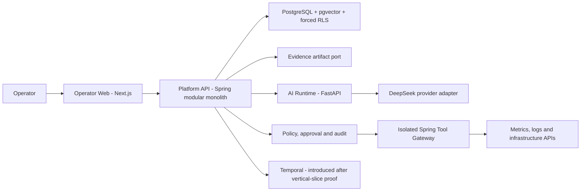

# OpsMind AI

OpsMind AI is an evidence-first AI SRE/DevSecOps platform. It is designed to help operators investigate incidents, explain hypotheses with traceable evidence, and execute narrowly approved remediation without granting an AI model direct infrastructure authority.

Phase 1 operating-envelope and architecture governance is complete. Phase 2
provides the pinned polyglot toolchain, cross-platform command surface, Compose
configuration, and PR quality gates. Phases 3, 4, and 5 are in progress: the
Platform API has a local fail-closed identity/tenant/data substrate and Phase 4
checkpoint 4A now implements the nested incident create/detail/transition/
timeline ledger. Provider, connector, evidence-object lifecycle, UI, and
remediation behavior remain owned by later checkpoints/phases. Phase 5 now has
an offline provider-neutral analysis contract, DeepSeek adapter, delegated
capability/replay guard, redaction policy, budget guard, and stream assembler;
durable PostgreSQL nonce/replay/invocation accounting now has an additive
schema and adapter, while live provider egress remains disabled.
Local PostgreSQL evidence now covers pooled RLS, per-request platform-user
deprovisioning, and outbox/inbox crash windows. Access-token policy requires
the configured audience, MFA AMR, and a maximum `PT5M` lifetime. A live local
Windows Keycloak 26.7 reference run passes the non-production OIDC conformance
profile, but it is not a production-vendor decision or release proof. Remote
CI/Compose and production identity conformance remain open. A dedicated
non-bypass database identity and tenant scheduler now own outbox lease/ack;
the external dispatcher loop remains disabled until its owning phase.

## Product Goal

Deliver a production-grade platform that:

- investigates incidents from authorized metrics, logs, traces, changes, runbooks, and topology evidence;
- separates observations, hypotheses, confidence, recommendations, and executed effects;
- integrates DeepSeek V4 Flash through a replaceable provider adapter;
- enforces tenant isolation and authorization before retrieval, ranking, generation, or tool execution;
- binds every write action to an exact preview, policy decision, approval, target state, and audit record;
- measures RCA quality, safety, latency, cost, calibration, and operator usefulness;
- deploys through local, CI, staging, and production gates without committed secrets;
- treats tests, audit artifacts, runbooks, restore drills, and evaluation evidence as release inputs.

## Non-Negotiable Invariants

1. Evidence precedes conclusions. The system never presents unsupported model output as observed fact.
2. The model cannot directly access infrastructure credentials or broad tenant data.
3. Authorization happens before retrieval and before action, not only in the user interface.
4. Read-only investigation is the default. Writes require policy, exact-action approval, idempotency, and reconciliation.
5. Tenant, actor, and scope are derived from verified platform claims rather than caller-supplied headers.
6. Heavy local work fails closed when disk capacity or configured storage roots are unsafe.
7. No API key, token, private key, credential, or raw sensitive prompt is committed.
8. A phase is complete only when its stated evidence exists and passes its gate.

## Initial Architecture



The first implementation uses four deployables: Operator Web, Platform API, AI Runtime, and Tool Gateway. PostgreSQL is the source of transactional truth. Redis is optional. Transactional outbox/inbox precedes Kafka. Temporal is introduced only after the deterministic investigation state machine and evaluation baseline are proven.

See [System Architecture](./docs/system-architecture.md) and [ADR-0001](./docs/adr/ADR-0001-platform-topology.md).

## Storage Safety First

This workstation uses `D:` for the repository and all heavyweight local state. Before installing dependencies, building containers, downloading models, running benchmarks, or starting training, run:

```powershell
powershell.exe -NoProfile -ExecutionPolicy Bypass -File .\scripts\storage\check-capacity.ps1
powershell.exe -NoProfile -ExecutionPolicy Bypass -File .\scripts\storage\assert-storage-roots.ps1 -CreateMissing
```

Portable shell:

```sh
./scripts/storage/check-capacity.sh
./scripts/storage/assert-storage-roots.sh --create-missing
```

Default safety thresholds are 10 GB free on `C:`, 20 GB free on `D:`, and 20 GB on every distinct portable filesystem containing the workspace or a configured cache/artifact/data/model root. A failed check exits non-zero. Capacity runs before root creation; when the default artifact root does not yet exist, it reports evidence to stdout only, then the root guard may create approved repository-contained defaults. Missing external roots, filesystem roots, repository ancestors, and reparse/symlink paths block without receiving default evidence. The scripts never delete, move, prune, or stop workloads.

The storage contract is:

| Variable | Purpose | Portable default |
|---|---|---|
| `OPS_CACHE_ROOT` | Dependency and build caches | `<repo>/.opsmind/cache` |
| `OPS_ARTIFACT_ROOT` | Verification, evaluation, security, and DR evidence | `<repo>/artifacts` |
| `OPS_DATA_ROOT` | Local databases and simulator data | `<repo>/.opsmind/data` |
| `OPS_MODEL_ROOT` | Model weights and training output | `<repo>/.opsmind/models` |

Blank storage values resolve relative to the checkout, so this workstation's
checkout on `D:` remains D-backed without embedding a machine-specific path.
The Windows guard rejects roots that resolve onto `C:`. Copy `.env.example` to
an untracked `.env` only for allowlisted, non-secret local configuration. The
launchers do not evaluate shell syntax and reject non-empty secret fields.
Supply secrets through the process environment or an approved secret manager.

## Standard Command Surface

The Windows and portable launchers expose the same commands. Every heavy
command except `down` runs capacity and storage-root checks before doing work.

```powershell
Copy-Item .env.example .env
.\scripts\dev\opsmind.ps1 setup
.\scripts\dev\opsmind.ps1 test
.\scripts\dev\opsmind.ps1 lint
.\scripts\dev\opsmind.ps1 build
.\scripts\dev\opsmind.ps1 security
```

```sh
cp .env.example .env
./scripts/dev/opsmind.sh setup
./scripts/dev/opsmind.sh test
./scripts/dev/opsmind.sh lint
./scripts/dev/opsmind.sh build
./scripts/dev/opsmind.sh security
```

| Command | Current behavior |
|---|---|
| `setup` | Installs checksum-verified actionlint 1.7.12, the locked pnpm workspace, locked Python environment, and Maven dependencies into configured D-backed caches. |
| `test`, `lint`, `build` | Runs the repository contract plus the relevant Next.js, Spring Boot, and FastAPI checks. |
| `dev`, `up`, `down` | Starts/stops the `application` Compose profile; `dev`/`up` require process-scoped migration and runtime database passwords plus explicit Docker-storage attestation. |
| `security`, `security-scan` | Scans repository secrets and Node, Python, and Java dependencies; Java CVSS 7+ fails the command. |
| `migrate` | Packages the Platform API and applies the current Flyway migrations with the explicitly supplied migration-role datasource. |
| `seed`, `evaluate` | Fails explicitly with exit code 3 until their owning phases implement deterministic seed data and evaluation contracts. |

Heavy commands are mutually exclusive per checkout. `doctor` validates the
declared toolchain and exits 6 on a version mismatch. Compose build/start is
also fail-closed until `OPS_DOCKER_STORAGE_VERIFIED=true` is supplied after the
operator verifies Docker/WSL storage is on a monitored non-system volume. CI
records a real `docker info`/`df` attestation before setting the flag, and every
language job repeats capacity preflight on its own runner.
pnpm script commands fail instead of silently reinstalling stale dependencies;
run `setup` explicitly to reconcile `node_modules` from the frozen lockfile. The
global virtual store is pinned off so setup, local runs, and CI use the same
project-local dependency layout.

Pinned inputs are `.node-version` (Node 24.12.0), `pnpm@11.15.0`,
`.python-version` (Python 3.13), `uv==0.11.29`, and `.java-version`
(Java 21), with `.maven-version` pinning Maven 3.9.12 and the bootstrap script
pinning actionlint 1.7.12 to official release SHA-256 digests and re-verifying
cache hits against the retained release archive. See [Local Development](./docs/local-development.md) for host
requirements, cache locations, and failure behavior.

## Repository Navigation

| Document | Purpose |
|---|---|
| [Project PDR](./docs/project-overview-pdr.md) | Product outcomes, scope, actors, requirements, and acceptance model |
| [System Architecture](./docs/system-architecture.md) | Components, trust boundaries, data flows, and failure strategy |
| [Local Development](./docs/local-development.md) | Safe host workflow for Windows and portable environments |
| [Deployment Guide](./docs/deployment-guide.md) | Environment promotion, configuration, rollback, and DR gates |
| [Testing Strategy](./docs/testing-strategy.md) | Test layers and authoritative release evidence |
| [Evaluation Strategy](./docs/evaluation-strategy.md) | RCA, safety, latency, cost, calibration, and human baseline |
| [Dataset Governance](./docs/dataset-governance.md) | Provenance, consent, deletion, lineage, and model withdrawal |
| [Security Model](./docs/security-model.md) | Assets, threat boundaries, policy enforcement, and incident response |
| [Code Standards](./docs/code-standards.md) | Repository ownership, naming, contracts, errors, tests, and migrations |
| [Codebase Summary](./docs/codebase-summary.md) | Verified current modules, entry points, contracts, and implemented boundaries |
| [Roadmap](./docs/project-roadmap.md) | Sixteen delivery phases and their gates |
| [Blockers](./docs/blockers.md) | Decisions or conditions that stop downstream work |
| [Progress](./docs/progress.md) | Evidence-backed delivery history |
| [Product/Production Contract](./docs/decisions/product-production-contract.md) | Blocking G0.5 choices for Phase 2 |
| [A-Z Plan](./plans/260719-1747-opsmind-ai-production-platform/plan.md) | Detailed phases, dependencies, risks, and Definition of Done |

## Delivery Gates

The roadmap contains sixteen phases. G0.5 records the approved deployment
archetype, target environment, tenant model, IdP profile, DeepSeek egress policy,
first live connector, evidence store, load/SLO/DR envelope, lifecycle rules, and
accountable owners. Its strict validator passes. Phase 2 local gates and the
Phase 3 trust-foundation slice are being advanced independently. The local
Keycloak 26.7 reference target passed again on 2026-07-22 against the current
Platform API JAR; remote CI, Compose smoke,
and an authorized production IdP profile are still required before the broader
gates can close. The disposable local PostgreSQL 18
matrix now proves migration-role separation, pooled tenant-context cleanup, and
messaging crash-window recovery. It also proves that an active platform user is
accepted and an unknown or deprovisioned issuer/subject mapping is denied. The
web role can append outbox records but cannot lease or acknowledge them; the
dispatcher role cannot see a tenant before an authorized workload binding.
Phase 4 checkpoint 4A adds source/JAR-bound local proof for incident CRUD
subset, idempotent replay, non-enumerating authorization, serialized membership
revocation, one-winner concurrency, atomic rollback, immutable timeline,
database-computed audit chaining, and fresh plus upgrade migration paths. Full
Phase 4, G2, and release remain open.

The approved starting profile is internal, single organization, Singapore
region, with logical tenant/project isolation and a managed-Kubernetes
production target.

## Evidence Layout

Generated evidence is local and ignored by Git:

```text
artifacts/
  verification/phase-XX/
  evaluation/
  security/
  dr/
```

The local Keycloak transcript records schema/scenario versions, runtime and
configuration digest, command, timestamps, `CodeRevision=UNBORN`, and
`WorkspaceDirty=YES`. It is ignored local evidence with scope
`REFERENCE_CONFORMANCE_NOT_PRODUCTION`, not immutable release evidence. The
Linux `identity-conformance` job is configured in
`.github/workflows/pr-quality.yml`, but no remote run is claimed. A green local
command without an immutable revision-bound artifact is not release proof.

## Current Verification

Run the complete Phase 2 local checks with:

```powershell
.\scripts\dev\opsmind.ps1 test
.\scripts\dev\opsmind.ps1 lint
.\scripts\dev\opsmind.ps1 build
.\scripts\dev\opsmind.ps1 security
.\scripts\validation\validate-phase-02-foundation.ps1
```

After storage preflight, reproduce the local Phase 3 identity reference with:

```powershell
pwsh -NoProfile -File .\scripts\validation\run-phase-03-keycloak-conformance.ps1
pwsh -NoProfile -File .\scripts\validation\verify-phase-03-keycloak-evidence.ps1
```

The passing reference covers PKCE S256, MFA/TOTP negative paths, RP-initiated
logout, refresh-token revocation, JWKS rotation refresh, disabled-user new-login
denial, rotated refresh-token reuse denial, an independent refresh family for
the revocation positive control, and Platform API token denials. It does not prove production rollout,
federation, browser/BFF session ownership, or live expiry after upstream
disable. The run proves a pre-issued JWT remains accepted immediately after
disable and asserts a 300-second lifetime plus 30-second skew: a 330-second
policy upper bound, not a measured disable-to-denial horizon. Checked-in
defaults use 60-second skew, for a 360-second upper bound.

The current runner/verifier contract uses evidence schema v2, binds a manifest
digest of profile/source inputs plus the packaged Platform API JAR digest, and
publishes the transcript atomically only after cleanup verifies. That corrected
schema passed a 124.694-second live local run and independent digest
verification. A failed run emits only bounded, sanitized diagnostics in
`identity-delegation-failure.txt`; it cannot satisfy the success verifier.

Reproduce Phase 4 checkpoint 4A after the capacity/root preflight:

```powershell
node .\scripts\validation\validate-phase-04-incident-contracts.mjs
powershell.exe -NoProfile -File .\scripts\validation\run-phase-04-domain-tests.ps1
powershell.exe -NoProfile -File .\scripts\validation\run-phase-04-local-postgres-contract.ps1
```

The four local artifacts under `artifacts/verification/phase-04/` cover static
contracts, 25 focused domain/controller tests, live PostgreSQL migrations/RLS/
rollback/concurrency, and audit-chain integrity. They remain reference evidence
because this checkout is unborn/dirty and no remote immutable CI run exists.

Validate the Phase 5 provider-neutral runtime checkpoint offline (no API key is
needed and no external provider call is made):

```powershell
node .\scripts\validation\validate-phase-05-ai-runtime.mjs
$env:PYTHONPATH = 'services/ai-runtime/src'
python -m pytest services/ai-runtime/tests -q
```

The checkpoint currently covers 149 passing offline tests for contract/fixture validation,
bounded HTTP ingress, disabled/degraded configuration, exact outbound host and
positive-pricing gates, signed request/TTL/replay enforcement, evidence-bound
classification/citations, cumulative pre/post-call token and cost ceilings,
DeepSeek no-retry error mapping, strict structured response validation,
complete stream assembly, and in-process replay compatibility. Five additional
PostgreSQL tests cover shared nonce replay, concurrent run reservation, tenant
RLS, successful response replay, expired-lease full charging, fail-closed
provider-overage accounting, and append-only capability-probe audit:

```powershell
$env:OPS_DOCKER_STORAGE_VERIFIED = 'true'
powershell.exe -NoProfile -File .\scripts\validation\run-phase-05-local-postgres-state.ps1
```

The dedicated database gate now passes locally on PostgreSQL 18.4 with V004/V005,
all five state/audit tests, and cleanup succeeding. Its transcript remains local
reference evidence because this checkout is unborn/dirty. Live egress,
provider terms/residency approval, and provider smoke evidence remain later
gates; cross-service RS256 capability conformance is already proven locally.

The Phase 1 governance suite and strict G0.5 contract remain prerequisites.
Phase 2 validation covers repository ownership, Windows/portable command
semantics, lockfiles, Compose, workflow syntax, secret scanning, and manifest
parsing. Phase 3 now adds the fail-closed OIDC boundary, tenant/RLS migration,
mandatory MFA AMR and bounded access-token lifetime policy, per-request
deprovision checks, delegation contracts, idempotency/optimistic-concurrency
scaffolding, and outbox/inbox lease, replay, poison, exact-byte, and sequence
substrate. The incident write ledger exists only at checkpoint 4A; no live
connector, model call, evidence-object lifecycle, full incident workflow,
external dispatcher, or remediation action exists until its owning phase
implements and verifies it.

## Security Note

Provider credentials are runtime secrets. DeepSeek configuration will enter through a secret manager or process environment and a provider adapter; it will never be embedded in source, documentation, fixtures, image layers, logs, prompts, or client-side bundles. Any credential disclosed outside the secret channel must be rotated before production use.

## Repository and release governance

The public repository About panel is synchronized from
[`.github/repository-metadata.yml`](./.github/repository-metadata.yml). Use
[CONTRIBUTING.md](./CONTRIBUTING.md) for the CK development workflow,
[SECURITY.md](./SECURITY.md) for private vulnerability reporting, and
[SUPPORT.md](./SUPPORT.md) for questions and troubleshooting. Final releases
must publish the same signed multi-architecture digest to Docker Hub and GHCR,
link the GHCR Package to this repository, and record immutable digests,
SBOM/provenance, scan results, and registry parity in the release evidence.

## Unresolved Questions

No G0.5 decision remains unresolved. Later-phase conformance and release gates
are maintained in [Blockers](./docs/blockers.md).
