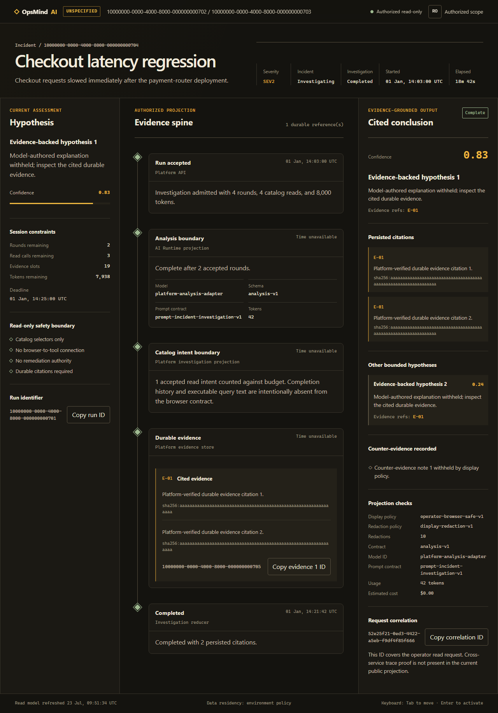
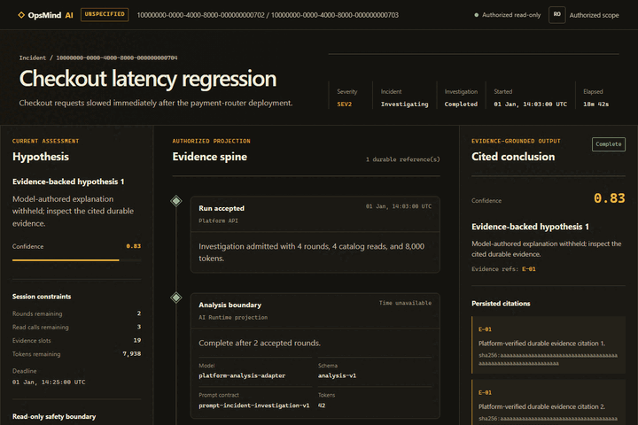
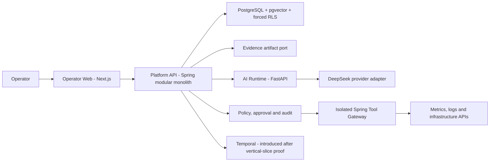

# OpsMind AI

OpsMind AI is an evidence-first AI SRE/DevSecOps platform. It is designed to help operators investigate incidents, explain hypotheses with traceable evidence, and execute narrowly approved remediation without granting an AI model direct infrastructure authority.

## Operator Experience



The operator workspace exposes a deliberately constrained projection: cited
durable evidence remains visible, while raw prompts, provider reasoning,
credentials, and unreviewed model-authored prose stay behind the server-side
trust boundary.



Both repository media files are review-gated by
[`docs/media/media-manifest.json`](./docs/media/media-manifest.json). The
secret scanner verifies their exact path, SHA-256 digest, byte size, media
signature, and dimensions; every other binary continues to fail closed.

Phase 1 governance is complete; Phases 2-7 are advancing through evidence gates.
The repository now contains a pinned polyglot workspace, cross-platform CI,
fail-closed OIDC and tenant/RLS foundations, an incident timeline/audit ledger,
a provider-neutral AI Runtime with DeepSeek adapter, and an isolated Tool
Gateway contract.

Phase 7 adds a pure bounded investigation reducer and feature-flagged runner.
Flyway V006 provides tenant-scoped PostgreSQL run snapshots, a contiguous
immutable investigation-event ledger, same-transaction audit-chain writes,
forced RLS, and optimistic concurrency. This is durable data, not a durable
workflow. V007 adds immutable bounded canonical evidence records, exact replay,
authorized reads, and full transaction rollback; revision-bound CI passes its
fresh/upgrade and 13-case PostgreSQL gate. Restart/resume remains Phase 9, and
current investigation events are not yet appended to the incident timeline.
The non-fixture investigation AI port now re-authorizes every evidence set,
assembles a selector-only bounded prompt, signs the exact canonical body, and
reuses the existing AI Runtime transport. The Platform Tool Gateway client
resolves only immutable catalog selectors, derives deterministic identities,
sends independent workload and one-use capability credentials, and accepts
only fully verified inline evidence. Durable Gateway stores, a live
non-production connector, CK/Stitch operator UI/browser E2E, cross-service
tracing, and p95 evidence remain open, so G3 is not claimed.

DeepSeek egress and all production credentials remain disabled by default.
Production identity/provider/legal conformance, evidence-object lifecycle,
RAG, remediation, DR, and release gates remain later work.

## Product Goal

Deliver a production-grade platform that:

- investigates incidents from authorized metrics, logs, traces, changes, runbooks, and topology evidence;
- separates observations, hypotheses, confidence, recommendations, and executed effects;
- integrates DeepSeek V4 Flash through a replaceable provider adapter;
- enforces tenant isolation and authorization before retrieval, ranking, generation, or tool execution;
- binds every write action to an exact preview, policy decision, approval, target state, and audit record;
- measures RCA quality, safety, latency, cost, calibration, and operator usefulness;
- deploys through local, CI, staging, and production gates without committed secrets;
- treats tests, audit artifacts, runbooks, restore drills, and evaluation evidence as release inputs.

## Non-Negotiable Invariants

1. Evidence precedes conclusions. The system never presents unsupported model output as observed fact.
2. The model cannot directly access infrastructure credentials or broad tenant data.
3. Authorization happens before retrieval and before action, not only in the user interface.
4. Read-only investigation is the default. Writes require policy, exact-action approval, idempotency, and reconciliation.
5. Tenant, actor, and scope are derived from verified platform claims rather than caller-supplied headers.
6. Heavy local work fails closed when disk capacity or configured storage roots are unsafe.
7. No API key, token, private key, credential, or raw sensitive prompt is committed.
8. A phase is complete only when its stated evidence exists and passes its gate.

## Initial Architecture



The first implementation uses four deployables: Operator Web, Platform API, AI Runtime, and Tool Gateway. PostgreSQL is the source of transactional truth. Redis is optional. Transactional outbox/inbox precedes Kafka. Temporal is introduced only after the deterministic investigation state machine and evaluation baseline are proven.

See [System Architecture](./docs/system-architecture.md) and [ADR-0001](./docs/adr/ADR-0001-platform-topology.md).

## Storage Safety First

This workstation uses `D:` for the repository and all heavyweight local state. Before installing dependencies, building containers, downloading models, running benchmarks, or starting training, run:

```powershell
powershell.exe -NoProfile -ExecutionPolicy Bypass -File .\scripts\storage\check-capacity.ps1
powershell.exe -NoProfile -ExecutionPolicy Bypass -File .\scripts\storage\assert-storage-roots.ps1 -CreateMissing
```

Portable shell:

```sh
./scripts/storage/check-capacity.sh
./scripts/storage/assert-storage-roots.sh --create-missing
```

Default safety thresholds are 10 GB free on `C:`, 20 GB free on `D:`, and 20 GB on every distinct portable filesystem containing the workspace or a configured cache/artifact/data/model root. A failed check exits non-zero. Capacity runs before root creation; when the default artifact root does not yet exist, it reports evidence to stdout only, then the root guard may create approved repository-contained defaults. Missing external roots, filesystem roots, repository ancestors, and reparse/symlink paths block without receiving default evidence. The scripts never delete, move, prune, or stop workloads.

The storage contract is:

| Variable | Purpose | Portable default |
|---|---|---|
| `OPS_CACHE_ROOT` | Dependency and build caches | `<repo>/.opsmind/cache` |
| `OPS_ARTIFACT_ROOT` | Verification, evaluation, security, and DR evidence | `<repo>/artifacts` |
| `OPS_DATA_ROOT` | Local databases and simulator data | `<repo>/.opsmind/data` |
| `OPS_MODEL_ROOT` | Model weights and training output | `<repo>/.opsmind/models` |

Blank storage values resolve relative to the checkout, so this workstation's
checkout on `D:` remains D-backed without embedding a machine-specific path.
The Windows guard rejects roots that resolve onto `C:`. Copy `.env.example` to
an untracked `.env` only for allowlisted, non-secret local configuration. The
launchers do not evaluate shell syntax and reject non-empty secret fields.
Supply secrets through the process environment or an approved secret manager.

## Standard Command Surface

The Windows and portable launchers expose the same commands. Every heavy
command except `down` runs capacity and storage-root checks before doing work.

```powershell
Copy-Item .env.example .env
.\scripts\dev\opsmind.ps1 setup
.\scripts\dev\opsmind.ps1 test
.\scripts\dev\opsmind.ps1 lint
.\scripts\dev\opsmind.ps1 build
.\scripts\dev\opsmind.ps1 security
```

```sh
cp .env.example .env
./scripts/dev/opsmind.sh setup
./scripts/dev/opsmind.sh test
./scripts/dev/opsmind.sh lint
./scripts/dev/opsmind.sh build
./scripts/dev/opsmind.sh security
```

| Command | Current behavior |
|---|---|
| `setup` | Installs checksum-verified actionlint 1.7.12, the locked pnpm workspace, locked Python environment, and Maven dependencies into configured D-backed caches. |
| `test`, `lint`, `build` | Runs the repository contract plus the relevant Next.js, Spring Boot, and FastAPI checks. |
| `dev`, `up`, `down` | Starts/stops the `application` Compose profile; `dev`/`up` require process-scoped migration and runtime database passwords plus explicit Docker-storage attestation. |
| `security`, `security-scan` | Scans repository secrets and Node, Python, and Java dependencies; Java CVSS 7+ fails the command. |
| `migrate` | Packages the Platform API and applies the current Flyway migrations with the explicitly supplied migration-role datasource. |
| `seed`, `evaluate` | Fails explicitly with exit code 3 until their owning phases implement deterministic seed data and evaluation contracts. |

Heavy commands are mutually exclusive per checkout. `doctor` validates the
declared toolchain and exits 6 on a version mismatch. Compose build/start is
also fail-closed until `OPS_DOCKER_STORAGE_VERIFIED=true` is supplied after the
operator verifies Docker/WSL storage is on a monitored non-system volume. CI
records a real `docker info`/`df` attestation before setting the flag, and every
language job repeats capacity preflight on its own runner.
pnpm script commands fail instead of silently reinstalling stale dependencies;
run `setup` explicitly to reconcile `node_modules` from the frozen lockfile. The
global virtual store is pinned off so setup, local runs, and CI use the same
project-local dependency layout.

Pinned inputs are `.node-version` (Node 24.12.0), `pnpm@11.15.0`,
`.python-version` (Python 3.13), `uv==0.11.29`, and `.java-version`
(Java 21), with `.maven-version` pinning Maven 3.9.12. The CI composite action
installs that Maven distribution from the official repository with SHA-512
verification; the bootstrap script pins actionlint 1.7.12 to official release
SHA-256 digests and re-verifies cache hits against the retained release archive.
See [Local Development](./docs/local-development.md) for host
requirements, cache locations, and failure behavior.

## Repository Navigation

| Document | Purpose |
|---|---|
| [Project PDR](./docs/project-overview-pdr.md) | Product outcomes, scope, actors, requirements, and acceptance model |
| [System Architecture](./docs/system-architecture.md) | Components, trust boundaries, data flows, and failure strategy |
| [Local Development](./docs/local-development.md) | Safe host workflow for Windows and portable environments |
| [Deployment Guide](./docs/deployment-guide.md) | Environment promotion, configuration, rollback, and DR gates |
| [Testing Strategy](./docs/testing-strategy.md) | Test layers and authoritative release evidence |
| [Evaluation Strategy](./docs/evaluation-strategy.md) | RCA, safety, latency, cost, calibration, and human baseline |
| [Dataset Governance](./docs/dataset-governance.md) | Provenance, consent, deletion, lineage, and model withdrawal |
| [Security Model](./docs/security-model.md) | Assets, threat boundaries, policy enforcement, and incident response |
| [Code Standards](./docs/code-standards.md) | Repository ownership, naming, contracts, errors, tests, and migrations |
| [Codebase Summary](./docs/codebase-summary.md) | Verified current modules, entry points, contracts, and implemented boundaries |
| [Roadmap](./docs/project-roadmap.md) | Sixteen delivery phases and their gates |
| [Blockers](./docs/blockers.md) | Decisions or conditions that stop downstream work |
| [Progress](./docs/progress.md) | Evidence-backed delivery history |
| [Product/Production Contract](./docs/decisions/product-production-contract.md) | Blocking G0.5 choices for Phase 2 |
| [A-Z Plan](./plans/260719-1747-opsmind-ai-production-platform/plan.md) | Detailed phases, dependencies, risks, and Definition of Done |

## Delivery Gates

The roadmap contains sixteen phases. G0.5 records the approved deployment
archetype, target environment, tenant model, IdP profile, DeepSeek egress policy,
first live connector, evidence store, load/SLO/DR envelope, lifecycle rules, and
accountable owners. Its strict validator passes. Revision-bound GitHub Actions
run `29923961768` proves Ubuntu/Windows bootstrap, PostgreSQL V001-V006 trust
contracts, Keycloak 26.7 conformance, Operator Web, AI Runtime, and Compose
build/health for commit `0ec3cff`. The overall run was cancelled after both
successful Java suites entered duplicate full-NVD downloads and hit their
60-minute limits. The replacement CycloneDX/OSV job is locally verified, and
revision-bound run `29930327761` passes every executable job on `8a6bd398`; its
security artifact covers two SBOMs and 208 packages with zero CVSS findings.
An authorized production IdP profile and the broader phase exits are still
required. The PostgreSQL matrix proves migration-
role separation, pooled tenant-context cleanup, messaging crash-window recovery,
and Phase 7 persistence/integrity. It also proves that an active platform user
is accepted and an unknown or deprovisioned issuer/subject mapping is denied. The
web role can append outbox records but cannot lease or acknowledge them; the
dispatcher role cannot see a tenant before an authorized workload binding.
Phase 4 checkpoint 4A adds source/JAR-bound local proof for incident CRUD
subset, idempotent replay, non-enumerating authorization, serialized membership
revocation, one-winner concurrency, atomic rollback, immutable timeline,
database-computed audit chaining, and fresh plus upgrade migration paths. Full
Phase 4, G2, and release remain open.

The approved starting profile is internal, single organization, Singapore
region, with logical tenant/project isolation and a managed-Kubernetes
production target.

## Verification

Generated workstation evidence is ignored under `artifacts/`; revision-bound CI
artifacts are authoritative for the checked commit. The main gates are:

```powershell
.\scripts\dev\opsmind.ps1 test
.\scripts\dev\opsmind.ps1 lint
.\scripts\dev\opsmind.ps1 build
.\scripts\dev\opsmind.ps1 security
node .\scripts\validation\validate-phase-07-investigation-slice.mjs
```

| Checkpoint | Current evidence | Scope limit |
|---|---|---|
| Governance/foundation | Secret scan, layout, portable surface, actionlint, Ubuntu/Windows bootstrap pass | G1 remains broader than one run |
| PostgreSQL trust | V001-V007, pooled tenant/RLS, messaging recovery, investigation persistence/evidence/upgrade/replay/rollback pass | Production database/DR and large-object lifecycle not proven |
| Identity | Keycloak 26.7 conformance passes locally and in Linux CI | Not production-authorized enterprise IdP proof |
| Incident control | CRUD subset, rollback/concurrency, timeline and audit-chain gates pass | Full Phase 4 remains open |
| AI Runtime | 149 offline tests plus PostgreSQL state gate pass; DeepSeek adapter defaults to `deepseek-v4-flash` | No live provider call or legal/residency approval |
| Tool Gateway | Static contract, Platform issuer conformance, workload OAuth boundary, and dual-credential Platform execution client pass | Durable stores and live connector pending |
| Investigation | Bounded-record checkpoint 4B, capability-backed AI rounds, and exact-bound Tool Gateway client pass | `PhaseExit=BLOCK`; live connector/UI/cross-service trace/p95 remain open |
| Compose | All application images build, start, and pass health smoke in CI | Not staging/production deployment evidence |

Historical local evidence marked `REFERENCE_CONFORMANCE_NOT_PRODUCTION` stays
useful for diagnosis but cannot close a release gate. No live connector, model
egress, external dispatcher, write remediation, RAG, or production release is
claimed until its owning phase supplies explicit evidence.

## Security Note

Provider credentials are runtime secrets. DeepSeek configuration will enter through a secret manager or process environment and a provider adapter; it will never be embedded in source, documentation, fixtures, image layers, logs, prompts, or client-side bundles. Any credential disclosed outside the secret channel must be rotated before production use.

## Repository and release governance

The public repository About panel is synchronized from
[`.github/repository-metadata.yml`](./.github/repository-metadata.yml). Use
[CONTRIBUTING.md](./CONTRIBUTING.md) for the CK development workflow,
[SECURITY.md](./SECURITY.md) for private vulnerability reporting, and
[SUPPORT.md](./SUPPORT.md) for questions and troubleshooting. Final releases
must publish the same signed multi-architecture digest to Docker Hub and GHCR,
link the GHCR Package to this repository, and record immutable digests,
SBOM/provenance, scan results, and registry parity in the release evidence.

## Unresolved Questions

No G0.5 decision remains unresolved. Later-phase conformance and release gates
are maintained in [Blockers](./docs/blockers.md).
