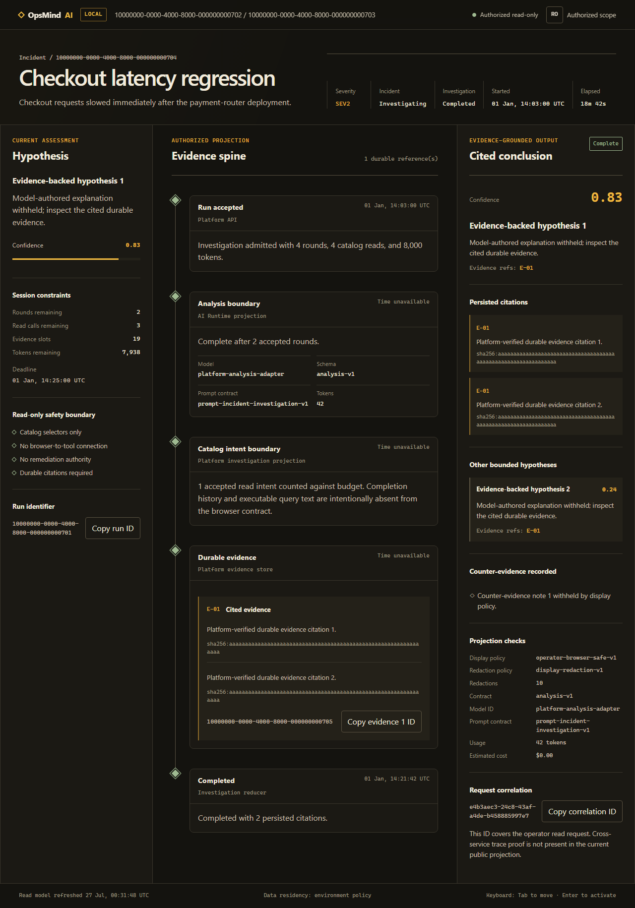
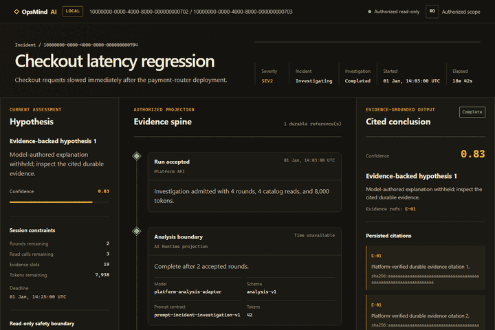
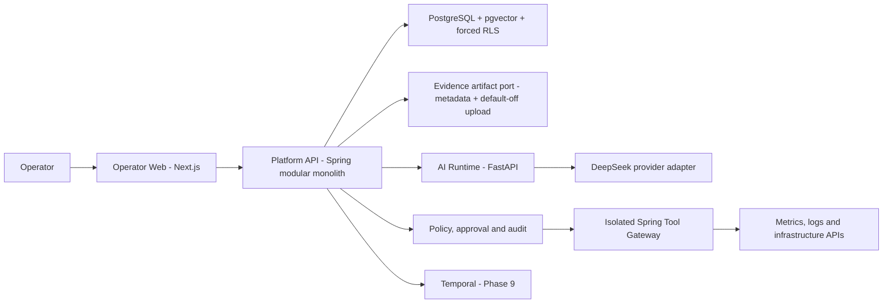

# OpsMind AI

OpsMind AI is an evidence-first AI SRE/DevSecOps platform. It is designed to help operators investigate incidents, explain hypotheses with traceable evidence, and execute narrowly approved remediation without granting an AI model direct infrastructure authority.

## Operator Experience



The operator workspace exposes cited durable evidence while raw prompts,
provider reasoning, credentials, and unreviewed model prose stay server-side.



Both repository media files are review-gated by
[`docs/media/media-manifest.json`](./docs/media/media-manifest.json). The
secret scanner verifies their exact path, SHA-256 digest, byte size, media
signature, and dimensions; every other binary continues to fail closed.

Phases 1-2 and gate G1 are complete; Phases 3-9 are advancing through evidence
gates. The repository contains a pinned polyglot workspace, cross-platform CI,
fail-closed OIDC and tenant/RLS foundations, an incident timeline/audit ledger,
a provider-neutral AI Runtime with DeepSeek adapter, and an isolated Tool Gateway.

Phase 7 adds a bounded investigation reducer, feature-flagged inline runner,
tenant-scoped PostgreSQL state, and immutable bounded evidence. Its ANALYZE-only
activity view read-unions ledgers without exposing payloads, free text,
credentials, or evidence/tool IDs. The AI port re-authorizes evidence, builds a
selector-only prompt, signs the canonical body, and reuses the AI Runtime
transport. The Tool Gateway client resolves immutable selectors, derives
deterministic identities, separates workload/capability credentials, and accepts
only verified inline evidence. Durable stores, synthetic Prometheus, CK/Stitch
UI/browser E2E, and a 100-warm-run cross-service trace pass. G3 still requires a
named live connector, provider/legal conformance, BFF/session proof, and
release-scale evidence.

Phase 9 adds a default-off Temporal start handoff. One transaction creates the
run, immutable V010 binding, and canonical outbox event; `temporal` returns
`202 + Location`, while default `inline` remains `200`. The claim commits before
the RPC, then reconciliation updates binding, inbox, and outbox.

V012 revokes direct workflow binding/inbox authority, hides canonical start rows
behind a dedicated `SECURITY DEFINER` claim, and preserves generic outbox order
through a resolver-owned predecessor check. V013 adds a fixed, read-only
reconciler identity with exactly three database capabilities, exact-workflow
Describe plus first-history verification, fenced settlement, bounded aggregate
metrics, and seven alert rules. Disposable fresh V001-V013 and V012-to-V013
real-role contracts pass, including direct/PUBLIC/membership denial, tenant
isolation, lease takeover, the outcome matrix, and four rollback failpoints.

Ambiguous post-RPC exhaustion parks the handoff `PENDING` with
`workflow.reconciliation-required`, not remote rejection. The reconciler can
observe and settle that state but cannot Start, signal, update, or cancel a
workflow. PR #45 and PR Quality run `30775354989` prove the repository-owned
runtime boundary with pinned local Temporal restart/replay, a fresh compatible
worker poller, a bounded live reconciliation scrape, and a sanitized CI-local
Alertmanager receipt. PR #56 and run `30802636501` add revision-bound pinned
Prometheus config, rule-syntax, and rule-behavior checks. B-017 remains active
for production database query-plan/latency and DR, live namespace retention/read-only
authorization, and external page delivery. Phase 9/G4 remain in progress;
B-013 and B-017 remain active. This is not production admission or a functional
investigation executor.

Phase 8B now implements three deterministic, training-ineligible evaluation
contracts: A detects a deployment-correlated latency regression, B terminates
`ABSTAINED` without tools when evidence is insufficient, and C performs two
opposing read-only evidence collections with counter-evidence and cautious
confidence. Tool executions are reconstructed from immutable intent, receipt,
audit, and evidence records. Platform V008 is a rolling expand migration: only
strict response-aware writes are evaluation-eligible. At revision `a975f922`,
PR-quality run `30257587569` and cross-service run `30257587543` are terminal
green; artifact `8649696519` records A/B/C `PASS`, samples `100/1/1`, and
`GitTree=0`. Phase 8 stays blocked: held-out cases, qualified human records/
adjudication, calibration, and human comparison are unavailable.

DeepSeek egress and all production credentials remain disabled by default.
Production identity/provider/legal conformance, evidence-object lifecycle,
RAG, remediation, DR, and release gates remain later work.

## Product Goal

Deliver a production-grade platform that:

- investigates incidents from authorized metrics, logs, traces, changes, runbooks, and topology evidence;
- separates observations, hypotheses, confidence, recommendations, and executed effects;
- integrates DeepSeek V4 Flash through a replaceable provider adapter;
- enforces tenant isolation and authorization before retrieval, ranking, generation, or tool execution;
- binds every write action to an exact preview, policy decision, approval, target state, and audit record;
- measures RCA quality, safety, latency, cost, calibration, and operator usefulness;
- deploys through local, CI, staging, and production gates without committed secrets;
- treats tests, audit artifacts, runbooks, restore drills, and evaluation evidence as release inputs.

## Non-Negotiable Invariants

1. Evidence precedes conclusions. The system never presents unsupported model output as observed fact.
2. The model cannot directly access infrastructure credentials or broad tenant data.
3. Authorization happens before retrieval and before action, not only in the user interface.
4. Read-only investigation is the default. Writes require policy, exact-action approval, idempotency, and reconciliation.
5. Tenant, actor, and scope are derived from verified platform claims rather than caller-supplied headers.
6. Heavy local work fails closed when disk capacity or configured storage roots are unsafe.
7. No API key, token, private key, credential, or raw sensitive prompt is committed.
8. A phase is complete only when its stated evidence exists and passes its gate.

## Initial Architecture


```mermaid
flowchart LR
    OP["Operator"] --> WEB["Operator Web - Next.js"]
    WEB --> API["Platform API - Spring modular monolith"]
    API --> DB["PostgreSQL + pgvector + forced RLS"]
    API --> OBJ["Evidence artifact port - metadata + default-off upload"]
    API --> AI["AI Runtime - FastAPI"]
    AI --> DSP["DeepSeek provider adapter"]
    API --> POL["Policy, approval and audit"]
    POL --> TG["Isolated Spring Tool Gateway"]
    TG --> OBS["Metrics, logs and infrastructure APIs"]
    API --> WF["Temporal - Phase 9"]
```

The first implementation uses four deployables: Operator Web, Platform API, AI Runtime, and Tool Gateway. PostgreSQL is the source of transactional truth. Redis is optional. Transactional outbox/inbox precedes Kafka. The default-off Temporal client and dispatcher role live in the Platform API artifact. Profile-gated local/CI conformance adds a pinned Temporal development server and workflow-only conformance worker; production Temporal remains external and disabled by default.

See [System Architecture](./docs/system-architecture.md) and [ADR-0001](./docs/adr/ADR-0001-platform-topology.md).

## Storage Safety First

This workstation uses `D:` for the repository and all heavyweight local state. Before installing dependencies, building containers, downloading models, running benchmarks, or starting training, run:

```powershell
powershell.exe -NoProfile -ExecutionPolicy Bypass -File .\scripts\storage\check-capacity.ps1
powershell.exe -NoProfile -ExecutionPolicy Bypass -File .\scripts\storage\assert-storage-roots.ps1 -CreateMissing
```

Portable shell:

```sh
./scripts/storage/check-capacity.sh
./scripts/storage/assert-storage-roots.sh --create-missing
```

Default safety thresholds are 10 GB free on `C:`, 20 GB free on `D:`, and 20 GB on every distinct portable filesystem containing the workspace or a configured cache/artifact/data/model root. A failed check exits non-zero. Capacity runs before root creation; when the default artifact root does not yet exist, it reports evidence to stdout only, then the root guard may create approved repository-contained defaults. Missing external roots, filesystem roots, repository ancestors, and reparse/symlink paths block without receiving default evidence. The scripts never delete, move, prune, or stop workloads.

The storage contract is:

| Variable | Purpose | Portable default |
|---|---|---|
| `OPS_CACHE_ROOT` | Dependency and build caches | `<repo>/.opsmind/cache` |
| `OPS_ARTIFACT_ROOT` | Verification, evaluation, security, and DR evidence | `<repo>/artifacts` |
| `OPS_DATA_ROOT` | Local databases and simulator data | `<repo>/.opsmind/data` |
| `OPS_MODEL_ROOT` | Model weights and training output | `<repo>/.opsmind/models` |

Blank storage values resolve relative to the checkout, so this workstation's
checkout on `D:` remains D-backed without embedding a machine-specific path.
The Windows guard rejects roots that resolve onto `C:`. Copy `.env.example` to
an untracked `.env` only for allowlisted, non-secret local configuration. The
launchers do not evaluate shell syntax and reject non-empty secret fields.
Supply secrets through the process environment or an approved secret manager.

## Standard Command Surface

The Windows and portable launchers expose the same commands. Every heavy
command except `down` runs capacity and storage-root checks before doing work.

```powershell
Copy-Item .env.example .env
.\scripts\dev\opsmind.ps1 setup
.\scripts\dev\opsmind.ps1 test
.\scripts\dev\opsmind.ps1 lint
.\scripts\dev\opsmind.ps1 build
.\scripts\dev\opsmind.ps1 security
```

```sh
cp .env.example .env
./scripts/dev/opsmind.sh setup
./scripts/dev/opsmind.sh test
./scripts/dev/opsmind.sh lint
./scripts/dev/opsmind.sh build
./scripts/dev/opsmind.sh security
```

| Command | Current behavior |
|---|---|
| `setup` | Installs checksum-verified actionlint 1.7.12, the locked pnpm workspace, locked Python environment, and Maven dependencies into configured D-backed caches. |
| `test`, `lint`, `build` | Runs the repository contract plus the relevant Next.js, Spring Boot, and FastAPI checks. |
| `dev`, `up`, `down` | Starts/stops the `application` Compose profile; `dev`/`up` require process-scoped migration and runtime database passwords plus explicit Docker-storage attestation. |
| `security`, `security-scan` | Scans repository secrets and Node, Python, and Java dependencies; Java CVSS 7+ fails the command. |
| `migrate` | Packages the Platform API and applies the current Flyway migrations with the explicitly supplied migration-role datasource. |
| `seed` | Remains unavailable and exits 3; no deterministic seed-data owner has landed. |
| `evaluate` | Runs evaluation unit/contract validation, then scores an existing managed Phase 7 trace. It does not generate the trace; missing, stale, dirty-revision, or incomplete trace evidence fails closed. |

Heavy commands are mutually exclusive per checkout. `doctor` validates the
declared toolchain and exits 6 on a version mismatch. Compose build/start is
also fail-closed until `OPS_DOCKER_STORAGE_VERIFIED=true` is supplied after the
operator verifies Docker/WSL storage is on a monitored non-system volume. CI
records a real `docker info`/`df` attestation before setting the flag, and every
language job repeats capacity preflight on its own runner.
pnpm script commands fail instead of silently reinstalling stale dependencies;
run `setup` explicitly to reconcile `node_modules` from the frozen lockfile. The
global virtual store is pinned off so setup, local runs, and CI use the same
project-local dependency layout.

Pinned inputs are `.node-version` (Node 24.12.0), `pnpm@11.15.0`,
`.python-version` (Python 3.13), `uv==0.11.29`, and `.java-version`
(Java 21), with `.maven-version` pinning Maven 3.9.12. The CI composite action
installs that Maven distribution from the official repository with SHA-512
verification; the bootstrap script pins actionlint 1.7.12 to official release
SHA-256 digests and re-verifies cache hits against the retained release archive.
See [Local Development](./docs/local-development.md) for host
requirements, cache locations, and failure behavior.

## Repository Navigation

| Document | Purpose |
|---|---|
| [Project PDR](./docs/project-overview-pdr.md) | Product outcomes, scope, actors, requirements, and acceptance model |
| [System Architecture](./docs/system-architecture.md) | Components, trust boundaries, data flows, and failure strategy |
| [Local Development](./docs/local-development.md) | Safe host workflow for Windows and portable environments |
| [Deployment Guide](./docs/deployment-guide.md) | Environment promotion, configuration, rollback, and DR gates |
| [Testing Strategy](./docs/testing-strategy.md) | Test layers and authoritative release evidence |
| [Evaluation Strategy](./docs/evaluation-strategy.md) | RCA, safety, latency, cost, calibration, and human baseline |
| [Dataset Governance](./docs/dataset-governance.md) | Provenance, consent, deletion, lineage, and model withdrawal |
| [Security Model](./docs/security-model.md) | Assets, threat boundaries, policy enforcement, and incident response |
| [Code Standards](./docs/code-standards.md) | Repository ownership, naming, contracts, errors, tests, and migrations |
| [Codebase Summary](./docs/codebase-summary.md) | Verified current modules, entry points, contracts, and implemented boundaries |
| [Roadmap](./docs/project-roadmap.md) | Sixteen delivery phases and their gates |
| [Blockers](./docs/blockers.md) | Decisions or conditions that stop downstream work |
| [Progress](./docs/progress.md) | Evidence-backed delivery history |
| [Product/Production Contract](./docs/decisions/product-production-contract.md) | Blocking G0.5 choices for Phase 2 |
| [A-Z Plan](./plans/260719-1747-opsmind-ai-production-platform/plan.md) | Detailed phases, dependencies, risks, and Definition of Done |

## Delivery Gates

The roadmap contains sixteen phases. G0.5 records the approved deployment
archetype, target environment, tenant model, IdP profile, DeepSeek egress policy,
first live connector, evidence store, load/SLO/DR envelope, lifecycle rules, and
accountable owners. Its strict validator passes. Revision-bound PR-quality run
`30257587569` on `a975f922` proves
Linux/Windows bootstrap, secret scan, actionlint, Compose health, AI Runtime,
both Java services, Operator Web, dependency security, Keycloak conformance,
and PostgreSQL trust. An authorized production IdP profile and broader phase
exits remain required. The PostgreSQL matrix proves migration-
role separation, pooled tenant-context cleanup, messaging crash-window recovery,
and Phase 7 persistence/integrity. It also proves that an active platform user
is accepted and an unknown or deprovisioned issuer/subject mapping is denied. The
web role can append outbox records but cannot lease or acknowledge them; the
dispatcher role cannot see a tenant before an authorized workload binding.
Phase 4 checkpoint 4A adds source/JAR-bound local proof for incident CRUD
subset, idempotent replay, non-enumerating authorization, serialized membership
revocation, one-winner concurrency, atomic rollback, immutable timeline,
database-computed audit chaining, and fresh plus upgrade migration paths. Full
Phase 4, G2, and release remain open.

The approved starting profile is internal, single organization, Singapore
region, with logical tenant/project isolation and a managed-Kubernetes
production target.

## Verification

Generated workstation evidence is ignored under `artifacts/`; revision-bound CI
artifacts are authoritative for the checked commit. The main gates are:

```powershell
.\scripts\dev\opsmind.ps1 test
.\scripts\dev\opsmind.ps1 lint
.\scripts\dev\opsmind.ps1 build
.\scripts\dev\opsmind.ps1 security
node .\scripts\validation\validate-phase-07-investigation-slice.mjs
node .\scripts\validation\validate-phase-08-evaluation-foundation.mjs
node .\scripts\validation\validate-phase-09-workflow-handoff.mjs
```

| Checkpoint | Current evidence | Scope limit |
|---|---|---|
| Governance/foundation | PR Quality run `30327014212` on tree `25d83c9a` proves zero-finding secret/layout/actionlint checks, clean Ubuntu and Windows bootstrap, Keycloak reference conformance, and Compose build/health/cleanup | G1 and Phase 2 complete; this is developer-platform evidence, not staging/production proof |
| PostgreSQL trust | V001-V009, pooled tenant/RLS, messaging recovery, investigation persistence/evidence, and V009 recovery/query-plan/latency/storage gates pass in job `89950772823`, artifact `8650178111` | CI fixture gates; production database/DR, SLO, and large-object lifecycle not proven |
| Identity | Keycloak 26.7 conformance passes locally and in Linux CI | Not production-authorized enterprise IdP proof |
| Incident control | CRUD subset, rollback/concurrency, timeline and audit-chain gates pass | Full Phase 4 remains open |
| AI Runtime | 159 offline tests plus five PostgreSQL-gated skips in current CI; the PostgreSQL state gate passes separately; DeepSeek defaults to `deepseek-v4-flash` | No live provider call or legal/residency approval |
| Tool Gateway | Static contract, durable PostgreSQL receipt/audit state, synthetic Prometheus connector, workload OAuth boundary, dual-credential Platform execution client, and local V003 tenant-scope unit/static gates pass | V003 PostgreSQL/upgrade evidence, named live non-production connector, and production conformance pending |
| Investigation | Bounded-record checkpoint 4B, ANALYZE-only activity view, V009 evidence, capability-backed AI rounds, CK/Stitch/browser proof, and Phase 7 regression PASS in artifact `8649696519` | G3 still requires a named live connector, provider/legal approval, and BFF/session proof |
| Artifact plane | V014 metadata authority plus V015 lease-fenced, bounded, default-off S3-compatible upload path pass the current static contract; fresh/upgrade database gates are wired | Integrated revision still needs remote CI; public ingress/read, scanning, retention/deletion receipts, restore, and production backend/KMS conformance remain blocked |
| Evaluation | Fresh disposable A/B/C score `PASS` on all eight metrics with samples `100/1/1`; exact CI command passes 61/61 | Held-out payloads, human adjudication, calibration, and comparison unavailable; Phase 8 exit is BLOCK |
| Workflow handoff | V010-V013 implement default-off atomic admission, capability-only dispatch, direct-row containment, ordering preservation, durable ambiguous-outcome hold, and a no-`Start` exact-workflow reconciliation/alert lane; PR #45/#56 prove merged-head database/runtime, local restart/replay, compatible polling, bounded live scrape, CI-local routing, and pinned rule checks | B-017 still blocks production Temporal admission/G4 pending production database query-plan/latency and DR, live namespace read-only/retention conformance, and external page delivery |
| Compose | All application images build, start, and pass health smoke in CI | Not staging/production deployment evidence |

Historical local evidence marked `REFERENCE_CONFORMANCE_NOT_PRODUCTION` stays
useful for diagnosis but cannot close a release gate. No live connector, model
egress, external dispatcher, write remediation, RAG, or production release is
claimed until its owning phase supplies explicit evidence.

## Security Note

Provider credentials are runtime secrets. DeepSeek configuration will enter through a secret manager or process environment and a provider adapter; it will never be embedded in source, documentation, fixtures, image layers, logs, prompts, or client-side bundles. Any credential disclosed outside the secret channel must be rotated before production use.

## Repository and release governance

The public About panel is synchronized from
[`.github/repository-metadata.yml`](./.github/repository-metadata.yml). See
[CONTRIBUTING.md](./CONTRIBUTING.md), [SECURITY.md](./SECURITY.md), and
[SUPPORT.md](./SUPPORT.md). The checked-in
[OCI publication workflow](./.github/workflows/container-publish.yml) verifies
exact-SHA multi-architecture candidates before protected promotion. Release
still requires Docker Hub/GHCR digest parity, signatures, SBOM/provenance,
scans, linked packages, and an immutable GitHub Release. Docker Hub credentials
must exist only in the protected environment.

## Unresolved Questions

No G0.5 decision remains unresolved; later-phase conformance and release gates are maintained in [Blockers](./docs/blockers.md).
