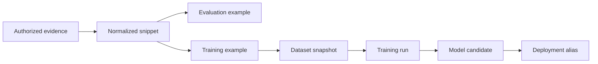

# Dataset and Model-Lineage Governance

## Purpose

Incident data can contain credentials, personal data, source code, customer identifiers, security findings, and operational secrets. It is not training data merely because the platform processed it. Dataset admission requires explicit authority and traceable lifecycle control.

## Data Classes

G0.5 approved a bounded starting policy, not a complete enterprise
classification taxonomy. Provider egress is limited to `redacted-metrics` and
`redacted-log-summaries`; all other classes remain denied until a later policy
explicitly permits them. The architecture supports at least:

- public;
- internal operational;
- confidential tenant;
- restricted security/credential-bearing;
- regulated or residency-bound;
- prohibited from provider egress;
- prohibited from training;
- approved synthetic.

Classification attaches to original evidence and is inherited by derived snippets, embeddings, summaries, evaluations, and dataset examples unless an approved transformation demonstrably lowers sensitivity.

## Dataset Admission

Every example requires:

- stable source and incident lineage;
- tenant and legal/contractual authority;
- data classification and residency;
- provider-egress and training eligibility decisions;
- redaction and review status;
- quality rubric result;
- retention/deletion class;
- dataset split assignment method;
- immutable content/configuration digest;
- admitting actor, time, and policy version.

Absence of any required field means exclusion, not a default approval.

## Provenance Graph

Each edge stores transformation identity, code/configuration digest, actor/workload identity, policy decision, and time. A model registry entry without a complete path back to authorized evidence cannot be promoted.

## Redaction

Redaction uses deterministic detectors plus review according to risk. Secrets, tokens, private keys, credentials, personal identifiers, internal URLs, and tenant-specific source content are removed or transformed as policy requires. Detection confidence and unresolved findings are retained as metadata.

Redaction does not create training authority by itself.

## Splits and Contamination

- Split by incident family, source, tenant boundary, and time where necessary.
- Keep held-out evaluation inaccessible to prompt, retrieval, fine-tuning, and development feedback loops.
- Detect near duplicates and derived paraphrases before assigning splits.
- Record base-model and provider exposure limitations where known.
- If held-out results guide tuning, retire that set from independent release use.

## Retention, Revocation, and Deletion

The approved starting lifecycle is 365 days for incident records, 90 days for
evidence, and 730 days for audit records. Deletion has a 24-hour SLA, training
eligibility is opt-in only, and residency is Singapore. These are policy
requirements from the
[Product/Production Contract](./decisions/product-production-contract.json),
not evidence that purge, backup expiry, or model-lineage withdrawal is already
implemented.

Authorization revocation is immediate for new access. Physical deletion can be asynchronous but must be bounded, observable, and evidenced. A deletion request traverses:

- evidence object and metadata;
- normalized content and caches;
- embeddings and retrieval indexes;
- prompt/exchange retention stores;
- evaluation and training examples;
- dataset snapshots;
- training checkpoints and candidate models;
- exports and backups according to approved recovery policy.

Generation epochs prevent stale indexes from reintroducing revoked material. Purge workers produce receipts and exception records. If removal from a trained model cannot be proven, affected models are quarantined from promotion/use until the approved remedy is complete.

## Dataset Versioning

A dataset version is immutable and content-addressed. Its manifest contains example identities/digests, split, schema, policy versions, transformation versions, exclusions, quality statistics, and lineage watermark. Mutating membership creates a new version.

## Model Registry and Promotion

Each candidate records:

- base model and license;
- code, environment, dependency, and training configuration digest;
- dataset snapshot and lineage watermark;
- hardware/runtime identity;
- evaluation suite and results;
- security and privacy scan results;
- cost and performance results;
- approval/rejection/quarantine decision and owner.

Aliases move transactionally and are reversible. Old candidates remain auditable subject to approved retention and deletion obligations.

## Access Control

Dataset curation, evaluation, training, registry promotion, and production alias changes are separate privileges. The training workload receives only the approved snapshot. It does not query tenant production databases directly.

## Verification Evidence

Phase 10 proves retrieval revoke/delete behavior. Phase 13 implements dataset manifests, admission, provenance, and withdrawal. Phase 14 proves bounded training, registry, shadow, and promotion gates. Phase 16 audits end-to-end deletion and lineage quarantine.

## Remaining Governance Work

Backup deletion semantics, legal basis, export controls, the complete
classification taxonomy, reviewer assignment, and the exact
model-unlearning/quarantine remedy remain later governance and implementation
gates. They do not reopen the approved G0.5 lifecycle, residency, training, or
provider-egress baseline. See the
[G0.5 approval record](./decisions/g0-5-approval-2026-07-19.md).
