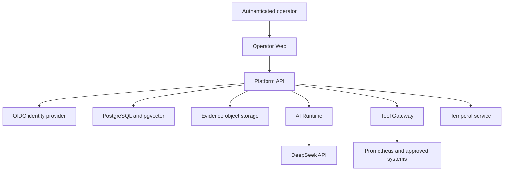
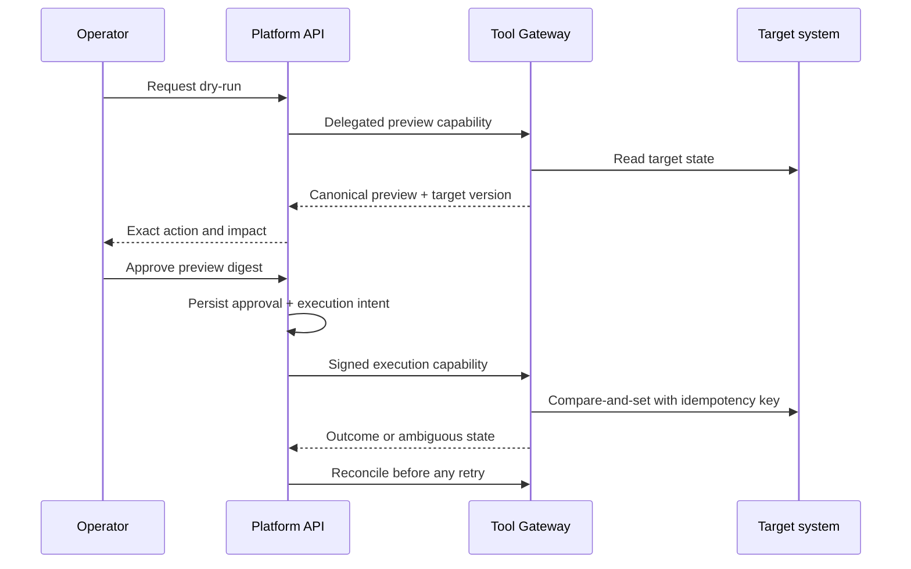

# OpsMind AI System Architecture

## Architecture Intent

OpsMind uses deterministic software to control identity, authorization, evidence, state transitions, budgets, approvals, and external effects. Models assist with interpretation and recommendation inside those boundaries. This split is the central architecture decision.

The first release uses a small number of deployables and explicit internal module boundaries. It avoids premature service decomposition while isolating the highest-risk credential and execution boundary.

## Context Diagram

Dashed future concerns are intentionally not represented as current runtime behavior. Temporal enters in Phase 9. G0.5 approves managed Kubernetes in Singapore, enterprise OIDC, MinIO locally, S3-compatible production evidence storage, and read-only Prometheus against synthetic non-production metrics; later phases must implement and verify them.

## Initial Deployables

| Deployable | Technology | Responsibility | Forbidden responsibility |
|---|---|---|---|
| Operator Web | Next.js | Operator workflows, evidence presentation, approval UX | Trusting client authorization or holding provider credentials |
| Platform API | Java 21 Spring | Identity, tenant scope, incidents, policies, audit, transactions, capabilities | Executing arbitrary connector code or model reasoning |
| AI Runtime | Python FastAPI | Provider adapters, prompt assembly, schema validation, evaluation hooks | Infrastructure credentials, tenant-wide database access, direct writes |
| Tool Gateway | Java 21 Spring | Credential isolation, connector policy, dry-run, target CAS, execution reconciliation | Accepting caller-supplied tenant/actor authority |

The Platform API starts as a modular monolith. Modules communicate through typed internal contracts and transactional events. Extraction requires measured scaling, isolation, ownership, or release-cadence evidence and a new ADR.

## Trust Zones

1. **Browser zone:** untrusted input and presentation. Every identifier and action is re-authorized server-side.
2. **Platform control zone:** source of identity-derived scope, policy, durable incident state, audit, and delegated capability issuance.
3. **AI zone:** receives only policy-approved evidence subsets; no broad database or infrastructure credentials.
4. **Tool execution zone:** isolated workload with connector credentials; validates platform-signed capabilities and action bindings.
5. **Data zone:** PostgreSQL, vector indexes, object storage, keys, backups, and lifecycle workers.
6. **External zone:** DeepSeek, IdP, observability systems, source control, orchestration platforms, and notification providers.

Every cross-zone call is authenticated, authorized, bounded, observable, and versioned.

The starting tenancy profile is one internal organization with logical project
isolation and at most 100 projects. Approval of that profile does not replace
application authorization, forced RLS, or cross-boundary isolation tests.

## Identity Boundary

The Platform API is a stateless OAuth 2.0 resource server. In OIDC mode,
Spring's issuer-discovery/JWKS decoder verifies issuer, signature, and standard
time claims. An OpsMind policy layer additionally requires the configured API
audience, bounded subject, explicit `iat`/`exp`, a configurable maximum token
lifetime (`PT5M` in the checked-in application, Compose, and environment
defaults), bounded clock skew, and the configured MFA value in `amr`. Arbitrary
tenant or role claims never become platform authority.

The decoder is pinned to RS256. Its shared discovery/JWKS HTTP client has
500-millisecond connect and read timeouts and admits at most one request per
exact target URI, per Platform API instance, per configured interval. The
checked-in interval is `PT1S`; startup validation permits 100 milliseconds to
one minute. Discovery and JWKS endpoints are separate targets, and the bound is
not coordinated across replicas. A same-target request inside the interval
fails closed. Consequently, a genuine signing-key rotation can temporarily
reject a token until the interval elapses.

When persistence is enabled, every authenticated `/api/v1/**` request resolves
the verified issuer/subject through the narrow database authority function.
Unknown or deprovisioned platform users receive a safe denial; authority-store
failure returns a safe dependency error instead of accepting stale platform
identity. Tenant, project, and resource access still requires authoritative
membership and RLS. This per-request platform check is separate from upstream
IdP disablement: disabling the IdP user blocks new login but an already issued
stateless access JWT remains usable. Its issuance lifetime is 300 seconds, but
timestamp enforcement includes configured clock skew (`PT30S` in the harness,
`PT60S` in checked-in defaults). The resulting policy upper bounds are 330 and
360 seconds respectively; the run proves immediate post-disable acceptance but
records the disable-to-denial horizon as not live-measured.

Normal checked-in configuration retains a non-routable issuer sentinel and
defaults to `fail-closed`. The isolated Keycloak 26.7 harness injects an
ephemeral HTTPS issuer and has locally proven PKCE S256, direct-grant and wrong-
verifier denial, MFA/TOTP behavior including same-timestep replay denial,
RP-initiated logout with refresh-after-logout denial, Platform API negative
token paths, JWKS rotation refresh, old refresh-token reuse denial after
rotation, refresh-token revocation, and disabled-user new-login denial. The
schema-v2 runner uses a separate refresh family for the immediately preceding
successful refresh positive control, so replay invalidation in the rotation
family cannot make the revocation proof provider-dependent. That live schema-v2
run and its digest verifier pass locally. Its scope is local/reference
non-production only. Production
IdP selection, federation, break-glass, state/nonce assurance, browser/BFF
session ownership, broader bearer-token replay controls, and production
revocation behavior remain unproven.

## Principal Data Flows

### Evidence-backed investigation

1. Platform API derives actor, organization, tenant, project, roles, and session assurance from verified identity.
2. Incident state machine validates the requested transition.
3. Platform issues a short-lived read capability scoped to incident, connector, query class, time range, and budget.
4. Tool Gateway validates capability signature, audience, expiry, nonce, policy version, and connector scope.
5. Evidence is normalized; original content is stored through the evidence-artifact port using content addressing and encryption.
6. Platform records metadata and an outbox event in the same database transaction.
7. AI Runtime receives an authorized, bounded evidence bundle and provider-egress decision.
8. Provider response is schema-validated. Unsupported claims remain hypotheses and cannot mutate incident facts.
9. UI displays evidence, hypotheses, contradictions, confidence, provider status, cost, and audit sequence.

### Exact-action remediation

An approval binds tenant, actor, incident, connector, action schema/version, normalized parameters, target identity/version, dry-run output digest, policy version, expiry, and execution nonce. “Exactly once” is not assumed; at-most-one effective write is established through target idempotency or discovery/reconciliation.

## Persistence Ownership

| Data | Source of truth | Notes |
|---|---|---|
| Identity mapping, tenants, projects | Platform PostgreSQL schema | Forced RLS plus application authorization |
| Incidents, hypotheses, approvals, intents | Platform PostgreSQL schema | Optimistic version and append-only audit linkage |
| Provider exchanges and budgets | AI Runtime schema or explicitly owned tables | Redacted and retention-bounded |
| Connector execution receipts | Tool Gateway schema or explicitly owned tables | Idempotency and reconciliation authority |
| Large evidence bodies | Evidence object port | Encrypted, content-addressed, lifecycle-controlled |
| Embeddings and retrieval metadata | PostgreSQL/pgvector | ACL checked before ranking; generation epochs |
| Workflow histories | Temporal | Introduced after deterministic state machine proof |

Each service owns its migrations. Shared tables without a single owner are prohibited.

## Incident Control Plane Checkpoint 4A

The Platform API now implements the first authoritative incident ledger. Public
routes are nested under organization and project scope and currently support
create, detail, explicit status transition, and timeline read. Java validates
scope, identifiers, bounded bodies, idempotency, strong ETags, transition
semantics, and safe RFC 9457 responses; a hidden-resource `404` uses a
correlation URN instead of reflecting tenant/project/incident identifiers.

One PostgreSQL transaction resolves the verified issuer/subject, binds tenant
context, locks the complete authorization tuple, claims idempotency, mutates the
incident, and appends the timeline, audit, and outbox effects. A concurrent
identity, organization, membership, project, or role revocation therefore
serializes with an already-authorized operation; the next operation observes
the revocation. Forced RLS remains a separate defense.

V003 enforces the legal state/version graph, exact authoritative timeline
payload, append-only history, and database-computed per-tenant audit chain. The
runtime cannot choose audit sequence or digest fields. A live failure-injection
test creates a real outbox primary-key conflict after timeline and audit append,
then proves incident, timeline, audit, and idempotency rows all rolled back.
This checkpoint does not implement incident list/patch/assignment,
postmortems, or the evidence-object lifecycle and does not close Phase 4 or G2.

## Consistency and Messaging

- PostgreSQL transactions protect state and matching outbox records.
- Consumers use inbox/deduplication records and stable event identities.
- The web runtime is append-only at the database privilege boundary. A
  separate `opsmind_dispatcher` login may lease, retry, poison, and acknowledge
  outbox rows but cannot insert events or read identity/service-account tables.
- A non-login `opsmind_dispatch_resolver` exposes only two SECURITY DEFINER
  operations: list tenants with claimable work and bind one authorized tenant
  plus service-account identity to the current transaction. It has no RLS
  bypass. Bounded batches plus `SKIP LOCKED` allow competing workers without a
  global payload view; switching tenants inside one transaction is denied.
- Outbox stores both queryable `jsonb` and the bounded original UTF-8 bytes;
  the digest is checked against the original bytes before dispatch. Rebuilding
  bytes from normalized `jsonb` is prohibited.
- A PostgreSQL trigger plus transaction advisory lock enforces contiguous
  per-aggregate sequence for every insert path. Dispatch claims use bounded
  leases, `FOR UPDATE SKIP LOCKED`, retry timestamps, and claim-token compare
  on acknowledgement. An expired lease is reclaimable; a poisoned predecessor
  blocks later events in that aggregate until explicit reconciliation.
- Delivery is at-least-once: a crash after external publish but before database
  acknowledgement can produce another physical publish. Stable event identity,
  transactional inbox state, and idempotent targets converge that to one
  logical side effect.
- Inbox claim, local side effect, and processed marker share one transaction.
  Rolled-back claims disappear, committed `received` orphans can be reclaimed,
  and `processed`/`poisoned` records deny duplicate handling.
- Kafka is deferred until measured throughput or independent ownership justifies it.
- Temporal workflow start has one outbox-driven owner and a deterministic workflow ID.
- Workflow code changes use version/build routing and golden-history replay.
- External effects are never inferred only from message delivery; they use execution receipts and reconciliation.

## Tenant Isolation

- Platform derives scope from verified session and membership records.
- Database roles are split by responsibility; application roles cannot bypass RLS.
- Tenant context is transaction-local and reset by transaction completion.
- Pool-reuse tests attempt cross-tenant leakage after success, failure, cancellation, and timeout.
- Evidence object keys do not grant access; authorization is checked against platform metadata.
- Retrieval applies authoritative ACL and generation epoch before vector or lexical ranking.
- AI Runtime receives incident-scoped material, not general tenant query credentials.

The Phase 3 baseline provisions a distinct `opsmind_app` runtime role with no
superuser or row-security-bypass privilege and no audit update/delete
privilege. The narrow `opsmind_context_resolver` role is also non-login,
non-superuser, and non-bypass; it owns only the issuer/subject and tenant-context
resolver functions. Authority-table policies grant that role the explicit read
path needed to validate membership, while tenant data remains forced-RLS
scoped. A separate `platform-migrate` job runs Flyway with the migration owner;
the long-running Platform API has Flyway disabled and connects only as the
non-owner role. The bootstrap script refuses blank or reused role passwords.
The local PostgreSQL 18 contract fixes Hikari to one physical connection and
proves no tenant context survives commit, rollback, failed membership setup,
or a statement-timeout cancellation. A transaction with no context, including
the background-job path, sees zero tenant rows. The same disposable harness
proves active-user resolution and immediate denial after platform
deprovisioning. It also applies forward migration V002 and proves the API role
cannot mutate dispatch state, the dispatcher sees no rows without context,
only tenants with active audience/scope-bound service accounts are schedulable,
and both tenant and workload context reset at transaction end. Remote CI and
production-authorized IdP conformance remain separate gates.

## Provider Boundary

The application layer depends on a provider-neutral `AnalysisAdapter` port;
DeepSeek-specific transport and payload mapping stay in an outbound adapter.
The adapter externalizes model name, base URL, timeout, retry, context budget,
response schema, and credential lookup. The default model is DeepSeek V4 Flash.
Egress is disabled by default and the approved `allowlisted-redacted` mode
permits only redacted metrics and redacted log summaries. Redaction and approved
provider region/terms are mandatory, provider retention is prohibited, the
initial monthly budget is USD 1,000, and failure falls back to human-only
investigation. Application code validates JSON, tool arguments, citations,
pre/post-call budgets, and continuation state.

Provider failure modes include throttling, timeout, truncated output, invalid JSON, schema drift, empty content, repeated tool calls, cost overrun, and ambiguous stream termination. The platform degrades to evidence browsing and manual investigation rather than bypassing policy.

The runtime accepts only requests whose canonical digest exactly matches a short-lived delegated capability. Signed tenant, incident, run, purpose, and data classifications must match the body; every evidence reference must declare matching source classification metadata, and every citation must bind an authorized evidence ID to its content digest. Ingress is bounded before JSON parsing by total bytes, chunk count, and receive time. An atomic cumulative allowance caps tokens and cost across a run and is translated into the provider completion limit; if provider execution may have started but the result is ambiguous, the full reservation is charged. Missing or zero live pricing keeps readiness degraded.

Durable model state lives in the `ai_runtime` PostgreSQL schema behind the dedicated non-owner, non-inheriting, non-RLS-bypass `opsmind_ai_runtime` login. V004 stores only hashed capability nonces, immutable run limits, cumulative usage, bounded active leases, secret-free invocation metadata, and validated normalized success responses. A lease lasts at least through the signed request deadline, so another replica cannot recover a legitimately active provider call; the configured lease duration is a floor for short requests. Row locks serialize reservations across replicas; an expired lease is converted to an ambiguous invocation and charged at its full reservation before another exchange is admitted. Forced RLS uses transaction-local signed tenant scope. Live provider readiness requires this shared backend; process-local state is test/disabled-mode only.

V005 adds append-only lifecycle and bounded usage metadata for synthetic provider
capability probes. Every process proves its own provider path; PostgreSQL
advisory transaction locking applies a provider/model/region hourly quota using
the database clock, while bounded startup and retry jitter prevents replica
probe synchronization. The runtime role can insert events and select only the
bounded routing/lifecycle columns needed to enforce the quota and finish a
started event; it cannot update, delete, or truncate them. The schema
deliberately has no tenant, prompt, evidence, credential, or response-body
fields. A cancelled probe attempts a shielded terminal audit write; an orphaned
started row is therefore an observable best-effort failure, not a false success.
The Platform API pins pgJDBC to `42.7.13`, with a contract test asserting that
resolved version.

`/health` is process liveness and always returns the stable, non-sensitive
status body. `/ready` uses the same body but returns `503` when the shared
database or startup/periodic provider capability probe is degraded; it returns
`200` only when readiness is `ok`. The DeepSeek HTTP transport sets
`trust_env=False`, so ambient proxy and CA environment settings are not
inherited. Redaction covers complete bearer/JWT values at both the Platform API
and AI-runtime egress boundaries.

## Tool Gateway Boundary (Phase 6 checkpoint)

`services/tool-gateway` is a separate Spring process. The only execution route
is `POST /internal/v1/tools/execute`; it requires a dedicated platform workload
JWT (`aud=opsmind-tool-gateway-workload`, `token_use=workload`) and a separate
one-use RS256 delegated capability (`aud=opsmind-tool-gateway`,
`token_use=delegated_capability`). Capability claims bind the exact tenant,
project, incident, run, composite `tool:action:schema` identifier, resource,
role, one-call budget, nonce, policy version, and expiry. The body is
non-authoritative and must match those claims exactly. A capability token cannot
be used as the workload bearer token.

Dispatch is registry-key based and reads the checked-in manifest through
`ToolManifestResourceLoader`; the fixture action is read-only, selector-bound,
typed, and limited to a synthetic observability target. Generic shell, URL,
filesystem, SQL, provider command, and admin-verb execution are not connector
primitives. `BoundedConnectorExecutor` applies a 32-slot backpressure bulkhead,
the signed deadline, a manifest timeout, cancellation, and recursive output
limits before DLP normalization. Metadata and nested content are validated and
redacted; oversized evidence fails closed until the Phase 4 artifact port is
durably wired. Request/evidence digests use recursively ordered JSON keys.

The default nonce replay, execution receipt, and audit adapters are deliberately
unavailable and return stable failure responses; fixture adapters are explicitly
non-production. `/health` remains process liveness and `/ready` returns `503`
until workload/capability JWKS plus durable stores and an enabled connector are
configured. The canonical OpenAPI route and Tool Gateway JSON Schemas are in
`packages/contracts/`; `scripts/validation/validate-phase-06-tool-gateway.mjs`
is a deterministic checkpoint gate. Phase 6 exit is still blocked by durable
atomic receipt/audit/artifact wiring, Platform API issuer conformance, three
connector families, one live non-production target, and provider-specific
cancellation/tenant-bulkhead proof.

## Evidence Artifact Port

The port accepts an authorized stream plus tenant, incident, source classification, retention class, and expected digest. It returns an opaque artifact ID, content digest, byte count, encryption metadata reference, and lifecycle version. MinIO is approved locally; production uses an S3-compatible backend behind `production-kms` with Singapore residency. The implementation must support:

- tenant-scoped authorization independent of object URL;
- server-side encryption with controlled key boundary;
- immutable/versioned write semantics where required;
- retention hold, deletion receipt, orphan reconciliation, malware scan, and restore verification;
- bounded streaming without loading full artifacts into memory.

See [ADR-0003](./adr/ADR-0003-evidence-artifact-storage.md).

## Reliability and Degraded Modes

- The initial envelope is one organization, 25 concurrent investigations, 500
  evidence events per second, and 120 model requests per minute.
- Initial service objectives are 99.9% availability, 500 ms API p95,
  120-minute RTO, and 15-minute RPO; later tests must prove them.
- Admission control rejects new heavy work when storage, audit, outbox, policy, or required dependency health is unsafe.
- Timeouts, retries, circuit breakers, bulkheads, queues, and budgets are defined per dependency and operation class.
- Read-only evidence exploration can remain available when model egress is disabled.
- Remediation is unavailable if approval, audit, intent persistence, target-state validation, or reconciliation is unhealthy.
- Restores start with workers and writes disabled; watermarks and external effects are reconciled before traffic resumes.
- Storage-full tests verify that audit and intent durability fail closed before external writes.

## Observability

Every request carries trace, correlation, tenant-safe subject, incident, workflow, connector, policy, and model-exchange identifiers. Logs exclude raw secrets and default to redacted evidence summaries. Metrics cover queue depth, budget use, provider failures, invalid schemas, denied capabilities, approval expiry, duplicate suppression, ambiguous effects, RLS failures, deletion lag, and restore status.

## Architecture Governance

- Architecture changes require an ADR with context, decision, consequences, evidence, rollback trigger, and supersession path.
- `packages/contracts/{openapi,json-schema,fixtures}` is the sole public contract source.
- `compose.yaml` is the sole root Compose file.
- Simulator components remain dev/test-only.
- Phase inventories may extend these decisions but cannot create parallel truth sources.

## Verification Evidence

Architecture claims become verified only through contract tests, provider conformance, tenant isolation suites, workflow replay, failure injection, evaluation, security review, and DR drills in later phases. Current Phase 3 evidence includes a live local PostgreSQL RLS/pool-reuse matrix, outbox/inbox crash-window recovery, API/dispatcher database-role separation, tenant-safe scheduling, SQL duplicate/order enforcement, static validation, Java tests, and a live local Keycloak 26.7 reference run. Checkpoint 4A adds live PostgreSQL create/read/transition, authorization-revocation serialization, idempotent replay, concurrency, rollback, semantic timeline/audit integrity, migration-upgrade, and append-only proofs.

For the Phase 5 checkpoint, the Python suite reports 149 passed and five
PostgreSQL-gated tests skipped when that database gate is not enabled; Ruff and
mypy are clean, and the full Maven suite passes. The Phase 5 static checkpoint
passes, including the pgJDBC pin, V005 audit, liveness/readiness separation,
strict JWT redaction, and `trust_env=False` checks. This is not a Phase 5 exit:
`B-004` remains active for provider region, processing terms, retention, and
redaction verification, and no passing synthetic smoke with an externally
injected rotated staging key exists. No live DeepSeek egress or production
egress is claimed.

The identity transcript is deliberately marked
`REFERENCE_CONFORMANCE_NOT_PRODUCTION`. It records a PASS plus runtime/config
identity and timing, but also `CodeRevision=UNBORN` and `WorkspaceDirty=YES` in
an ignored local artifact. The configured Linux CI job has not run remotely.
No delegated-capability, production session, federation, break-glass,
state/nonce, or general bearer-replay proof is inferred from that result.

The current evidence contract is schema v2: a source/profile manifest digest
and packaged Platform API JAR digest bind the run to its inputs, cleanup must
verify before atomic publication, and a separate verifier rejects stale fields
or hashes. The live local artifact passes that verifier. A failed execution
publishes a separate bounded, sanitized diagnostic artifact and never a success
artifact.

## Remaining Architecture Gates

All twelve G0.5 decisions are approved in the
[Product/Production Contract](./decisions/product-production-contract.json).
Detailed cloud topology, production IdP/provider conformance, policy enforcement, storage
and KMS design, connector behavior, measured load/SLO evidence, lifecycle
workers, and named environment bindings remain later gates. The four-hour
artifact restore target must be reconciled with the 120-minute service RTO.
