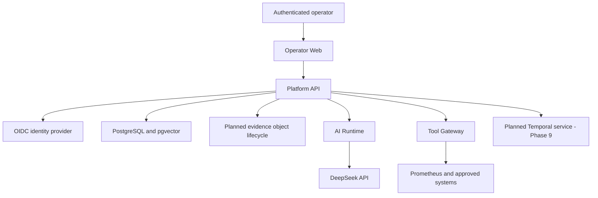
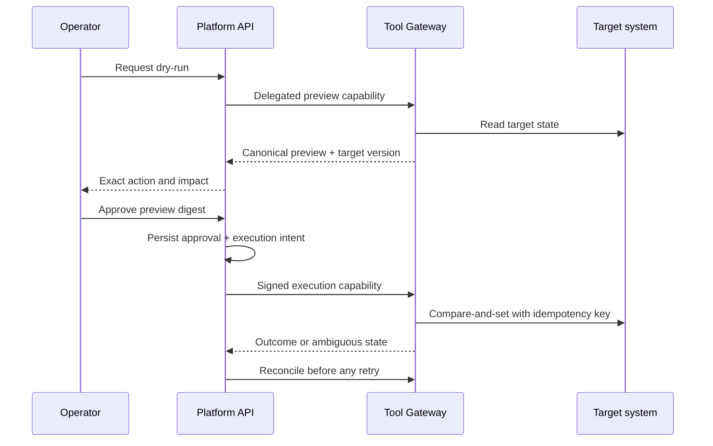

# OpsMind AI System Architecture

## Architecture Intent

OpsMind uses deterministic software to control identity, authorization, evidence, state transitions, budgets, approvals, and external effects. Models assist with interpretation and recommendation inside those boundaries. This split is the central architecture decision.

The first release uses a small number of deployables and explicit internal module boundaries. It avoids premature service decomposition while isolating the highest-risk credential and execution boundary.

## Context Diagram

```mermaid
flowchart TB
    USER["Authenticated operator"] --> WEB["Operator Web"]
    WEB --> API["Platform API"]
    API --> IDP["OIDC identity provider"]
    API --> DB["PostgreSQL and pgvector"]
    API --> OBJECTS["Planned evidence object lifecycle"]
    API --> AIR["AI Runtime"]
    AIR --> DEEPSEEK["DeepSeek API"]
    API --> TOOL["Tool Gateway"]
    TOOL --> PROM["Prometheus and approved systems"]
    API --> TEMPORAL["Planned Temporal service - Phase 9"]
```

Dashed future concerns are intentionally not represented as current runtime
behavior. Phase 9 now provides a default-off Temporal client and workflow-start
handoff inside the Platform API artifact, but no Temporal service, namespace,
worker, or live execution environment is deployed. G0.5 approves managed
Kubernetes in Singapore, enterprise OIDC, MinIO locally, S3-compatible
production evidence storage, and read-only Prometheus against synthetic
non-production metrics; later phases must implement and verify them.

## Initial Deployables

| Deployable | Technology | Responsibility | Forbidden responsibility |
|---|---|---|---|
| Operator Web | Next.js | Operator workflows, evidence presentation, approval UX | Trusting client authorization or holding provider credentials |
| Platform API | Java 21 Spring | Identity, tenant scope, incidents, policies, audit, transactions, capabilities | Executing arbitrary connector code or model reasoning |
| AI Runtime | Python FastAPI | Provider adapters, prompt assembly, schema validation, evaluation hooks | Infrastructure credentials, tenant-wide database access, direct writes |
| Tool Gateway | Java 21 Spring | Credential isolation, connector policy, dry-run, target CAS, execution reconciliation | Accepting caller-supplied tenant/actor authority |

The Platform API starts as a modular monolith. Modules communicate through typed internal contracts and transactional events. Extraction requires measured scaling, isolation, ownership, or release-cadence evidence and a new ADR.

## Trust Zones

1. **Browser zone:** untrusted input and presentation. Every identifier and action is re-authorized server-side.
2. **Platform control zone:** source of identity-derived scope, policy, durable incident state, audit, and delegated capability issuance.
3. **AI zone:** receives only policy-approved evidence subsets; no broad database or infrastructure credentials.
4. **Tool execution zone:** isolated workload with connector credentials; validates platform-signed capabilities and action bindings.
5. **Data zone:** PostgreSQL, vector indexes, object storage, keys, backups, and lifecycle workers.
6. **External zone:** DeepSeek, IdP, observability systems, source control, orchestration platforms, and notification providers.

Every cross-zone call is authenticated, authorized, bounded, observable, and versioned.

The starting tenancy profile is one internal organization with logical project
isolation and at most 100 projects. Approval of that profile does not replace
application authorization, forced RLS, or cross-boundary isolation tests.

## Identity Boundary

The Platform API is a stateless OAuth 2.0 resource server. In OIDC mode,
Spring's issuer-discovery/JWKS decoder verifies issuer, signature, and standard
time claims. An OpsMind policy layer additionally requires the configured API
audience, bounded subject, explicit `iat`/`exp`, a configurable maximum token
lifetime (`PT5M` in the checked-in application, Compose, and environment
defaults), bounded clock skew, and the configured MFA value in `amr`. Arbitrary
tenant or role claims never become platform authority.

The decoder is pinned to RS256. Its shared discovery/JWKS HTTP client has
500-millisecond connect and read timeouts and admits at most one request per
exact target URI, per Platform API instance, per configured interval. The
checked-in interval is `PT1S`; startup validation permits 100 milliseconds to
one minute. Discovery and JWKS endpoints are separate targets, and the bound is
not coordinated across replicas. A same-target request inside the interval
fails closed. Consequently, a genuine signing-key rotation can temporarily
reject a token until the interval elapses.

When persistence is enabled, every authenticated `/api/v1/**` request resolves
the verified issuer/subject through the narrow database authority function.
Unknown or deprovisioned platform users receive a safe denial; authority-store
failure returns a safe dependency error instead of accepting stale platform
identity. Tenant, project, and resource access still requires authoritative
membership and RLS. This per-request platform check is separate from upstream
IdP disablement: disabling the IdP user blocks new login but an already issued
stateless access JWT remains usable. Its issuance lifetime is 300 seconds, but
timestamp enforcement includes configured clock skew (`PT30S` in the harness,
`PT60S` in checked-in defaults). The resulting policy upper bounds are 330 and
360 seconds respectively; the run proves immediate post-disable acceptance but
records the disable-to-denial horizon as not live-measured.

Normal checked-in configuration retains a non-routable issuer sentinel and
defaults to `fail-closed`. The isolated Keycloak 26.7 harness injects an
ephemeral HTTPS issuer and has locally proven PKCE S256, direct-grant and wrong-
verifier denial, MFA/TOTP behavior including same-timestep replay denial,
RP-initiated logout with refresh-after-logout denial, Platform API negative
token paths, JWKS rotation refresh, old refresh-token reuse denial after
rotation, refresh-token revocation, and disabled-user new-login denial. The
schema-v2 runner uses a separate refresh family for the immediately preceding
successful refresh positive control, so replay invalidation in the rotation
family cannot make the revocation proof provider-dependent. That live schema-v2
run and its digest verifier pass locally. Its scope is local/reference
non-production only. Production
IdP selection, federation, break-glass, state/nonce assurance, browser/BFF
session ownership, broader bearer-token replay controls, and production
revocation behavior remain unproven.

## Principal Data Flows

### Evidence-backed investigation

1. Platform API derives actor, organization, tenant, project, roles, and session assurance from verified identity.
2. Incident state machine validates the requested transition.
3. Platform issues a short-lived read capability scoped to incident, connector, query class, time range, and budget.
4. Tool Gateway validates capability signature, audience, expiry, nonce, policy version, and connector scope.
5. Evidence is normalized. Bounded redacted canonical records are stored in PostgreSQL; large or raw content must use the evidence-artifact port once that lifecycle is implemented.
6. Platform links accepted evidence, the investigation event, and audit metadata in one database transaction.
7. AI Runtime receives an authorized, bounded evidence bundle and provider-egress decision.
8. Provider response is schema-validated. Unsupported claims remain hypotheses and cannot mutate incident facts.
9. UI displays evidence, hypotheses, contradictions, confidence, provider status, cost, and audit sequence.

### Planned exact-action remediation

```mermaid
sequenceDiagram
    participant O as Operator
    participant P as Platform API
    participant G as Tool Gateway
    participant T as Target system
    O->>P: Request dry-run
    P->>G: Delegated preview capability
    G->>T: Read target state
    G-->>P: Canonical preview + target version
    P-->>O: Exact action and impact
    O->>P: Approve preview digest
    P->>P: Persist approval + execution intent
    P->>G: Signed execution capability
    G->>T: Compare-and-set with idempotency key
    G-->>P: Outcome or ambiguous state
    P->>G: Reconcile before any retry
```

This flow is a future contract, not current runtime behavior. An approval will
bind tenant, actor, incident, connector, action schema/version, normalized
parameters, target identity/version, dry-run output digest, policy version,
expiry, and execution nonce. “Exactly once” is not assumed; at-most-one
effective write requires target idempotency or discovery/reconciliation.

## Persistence Ownership

| Data | Source of truth | Notes |
|---|---|---|
| Identity mapping, tenants, projects | Platform PostgreSQL schema | Forced RLS plus application authorization |
| Incidents, hypotheses, approvals, intents | Platform PostgreSQL schema | Optimistic version and append-only audit linkage |
| Provider exchanges and budgets | AI Runtime schema or explicitly owned tables | Redacted and retention-bounded |
| Connector execution receipts and verified audit | Tool Gateway schema | Capability-derived scope, forced tenant/project RLS, idempotency, and reconciliation authority |
| Unverified tool security decisions | Tool Gateway global audit lane | Insert-only and append-only; never accepts tenant/project fields from the request |
| Bounded redacted evidence records | Platform PostgreSQL schema | Immutable canonical JSON, 64 KiB maximum, run/event linkage, forced RLS |
| Investigation workflow binding/start event | Platform PostgreSQL schema | V010 immutable target/request binding plus canonical outbox bytes; default off |
| Large evidence bodies | Planned evidence object port | Lifecycle is not implemented |
| Embeddings and retrieval metadata | Planned PostgreSQL/pgvector boundary | RAG is not implemented |
| Workflow histories | External Temporal boundary | Client/reconciliation code exists; no cluster, namespace, worker, or history is deployed |

Each service owns its migrations. Shared tables without a single owner are prohibited.

## Incident Control Plane Checkpoint 4A

The Platform API now implements the first authoritative incident ledger. Public
routes are nested under organization and project scope and currently support
create, detail, explicit status transition, and timeline read. Java validates
scope, identifiers, bounded bodies, idempotency, strong ETags, transition
semantics, and safe RFC 9457 responses; a hidden-resource `404` uses a
correlation URN instead of reflecting tenant/project/incident identifiers.

One PostgreSQL transaction resolves the verified issuer/subject, binds tenant
context, locks the complete authorization tuple, claims idempotency, mutates the
incident, and appends the timeline, audit, and outbox effects. A concurrent
identity, organization, membership, project, or role revocation therefore
serializes with an already-authorized operation; the next operation observes
the revocation. Forced RLS remains a separate defense.

V003 enforces the legal state/version graph, exact authoritative timeline
payload, append-only history, and database-computed per-tenant audit chain. The
runtime cannot choose audit sequence or digest fields. A live failure-injection
test creates a real outbox primary-key conflict after timeline and audit append,
then proves incident, timeline, audit, and idempotency rows all rolled back.
This checkpoint does not implement incident list/patch/assignment,
postmortems, or the evidence-object lifecycle and does not close Phase 4 or G2.

### Incident activity timeline representation

`GET /api/v1/organizations/{organizationId}/projects/{projectId}/incidents/
{incidentId}/timeline` now has two representations without changing the legacy
JSON contract. Missing `Accept`, `*/*`, or an equal-quality choice selects
`application/json`; that path still requires `incident:read` plus `READ`
access, reads only `incident_timeline_events`, and uses the existing v1
incident-version cursor and response schema.

The opt-in
`application/vnd.opsmind.incident-activity-timeline.v1+json` representation
requires `incident:analyze` plus `ANALYZE` access. Inside the existing hidden-
denial transaction, it authorizes before lookup and runs a parameterized
`UNION ALL` over `incident_timeline_events` and `investigation_run_events`.
Both branches filter the exact organization, project, and incident. The query
projects only these eight possible entry fields:

| Field | Availability |
|---|---|
| `eventId`, `source`, `eventType`, `occurredAt`, `actorId` | Both sources |
| `incidentVersion` | Incident source only |
| `investigationRunId`, `investigationSequence` | Investigation source only |

The SQL never selects either ledger's JSON `payload` and exposes no reason,
root-cause, resolution, prompt, model prose, credential, evidence/tool
identifier, or other free text. Results order by
`(occurred_at, source_rank, event_id)`, where incident is rank 0 and
investigation is rank 1. The v2 cursor binds the incident and the exact
database-returned microsecond timestamp, source rank, and event ID.

This is a forward-only live view, not a snapshot or lossless change feed. A
row committed later at or before an issued cursor can be absent from that
continuation; callers must start a fresh traversal to discover late backdated
rows. No investigation row is copied into `incident_timeline_events`.

Negotiation uses RFC 9110 media-range specificity before quality. JSON wins
ties for compatibility; the vendor type is selected only when its selected
quality is strictly higher and nonzero. Unsupported ranges can coexist with a
supported range, while malformed media types, unsupported-only choices, or
vendor parameters other than `q` return `406`. Both successful responses set
`Vary: Accept`; the vendor response also sets `Cache-Control: no-store`.

OpenAPI 3.1 cannot attach a different standard security requirement to each
response media type. The operation therefore lists both scopes and uses the
`x-opsmind-representation-security` extension to record the per-
representation scope/access-mode mapping. Generic OpenAPI generators may
ignore this extension; runtime authorization and the checked contract tests
remain authoritative.

Platform V009 adds only the two concurrent ordering indexes
`incident_timeline_activity_order_idx` and
`investigation_run_events_activity_order_idx`; its script-level Flyway config
sets `executeInTransaction=false`. The persistence profile sets
`spring.flyway.postgresql.transactional-lock=false`: PostgreSQL concurrent
index creation cannot wait on Flyway's own history-lock transaction, while the
resulting session-level advisory lock still serializes migration runners.
Deployment applies V009 before new code. If either concurrent build fails,
operators capture Flyway history and both index catalog rows, drop both exact
V009 index names concurrently, run the approved Flyway repair seam, and retry;
applied migration bytes and history are never edited blindly.

PR Quality run `30257587569`, PostgreSQL job `89950772823`, and artifact
`8650178111` prove fresh/upgrade, failed-build recovery, branch-bounded query
plans, legacy-write compatibility, cleanup, and the 3/3 activity HTTP matrix on
`a975f922`. The 60,600/61,206-row fixture passed append/vendor latency and
storage gates: append p95 regressions were 11.66%/4.02%; vendor initial/rank-0/
rank-1 p95 was 2.563/1.466/1.533 ms; index cost was 95.70 bytes/source row and
10.76% of source-table bytes. These are CI fixture/test gates, not production
latency or SLO evidence.

## Consistency and Messaging

- PostgreSQL transactions protect state and matching outbox records.
- Consumers use inbox/deduplication records and stable event identities.
- The web runtime is append-only at the database privilege boundary. A
  separate `opsmind_dispatcher` login may lease, retry, poison, and acknowledge
  outbox rows but cannot insert events or read identity/service-account tables.
- A non-login `opsmind_dispatch_resolver` exposes only two SECURITY DEFINER
  operations: list tenants with claimable work and bind one authorized tenant
  plus service-account identity to the current transaction. It has no RLS
  bypass. Bounded batches plus `SKIP LOCKED` allow competing workers without a
  global payload view; switching tenants inside one transaction is denied.
- Outbox stores both queryable `jsonb` and the bounded original UTF-8 bytes;
  the digest is checked against the original bytes before dispatch. Rebuilding
  bytes from normalized `jsonb` is prohibited.
- A PostgreSQL trigger plus transaction advisory lock enforces contiguous
  per-aggregate sequence for every insert path. Dispatch claims use bounded
  leases, `FOR UPDATE SKIP LOCKED`, retry timestamps, and claim-token compare
  on acknowledgement. An expired lease is reclaimable; a poisoned predecessor
  blocks later events in that aggregate until explicit reconciliation.
- Delivery is at-least-once: a crash after external publish but before database
  acknowledgement can produce another physical publish. Stable event identity,
  transactional inbox state, and idempotent targets converge that to one
  logical side effect.
- Inbox claim, local side effect, and processed marker share one transaction.
  Rolled-back claims disappear, committed `received` orphans can be reclaimed,
  and `processed`/`poisoned` records deny duplicate handling.
- Kafka is deferred until measured throughput or independent ownership justifies it.
- Temporal workflow start has one default-off outbox-driven owner and the
  deterministic ID `opsmind-investigation/{organizationId}/{runId}`.
- The dispatcher claim transaction commits before the Temporal RPC. The RPC is
  outside every database transaction; a later transaction atomically reconciles
  binding, inbox, and outbox state.
- Future workflow code changes use version/build routing and golden-history replay.
- External effects are never inferred only from message delivery; they use execution receipts and reconciliation.

## Tenant Isolation

- Platform derives scope from verified session and membership records.
- Database roles are split by responsibility; application roles cannot bypass RLS.
- Tenant context is transaction-local and reset by transaction completion.
- Pool-reuse tests attempt cross-tenant leakage after success, failure, cancellation, and timeout.
- Evidence object keys do not grant access; authorization is checked against platform metadata.
- Retrieval applies authoritative ACL and generation epoch before vector or lexical ranking.
- AI Runtime receives incident-scoped material, not general tenant query credentials.

The Phase 3 baseline provisions a distinct `opsmind_app` runtime role with no
superuser or row-security-bypass privilege and no audit update/delete
privilege. The narrow `opsmind_context_resolver` role is also non-login,
non-superuser, and non-bypass; it owns only the issuer/subject and tenant-context
resolver functions. Authority-table policies grant that role the explicit read
path needed to validate membership, while tenant data remains forced-RLS
scoped. A separate `platform-migrate` job runs Flyway with the migration owner;
the long-running Platform API has Flyway disabled and connects only as the
non-owner role. The bootstrap script refuses blank or reused role passwords.
The local PostgreSQL 18 contract fixes Hikari to one physical connection and
proves no tenant context survives commit, rollback, failed membership setup,
or a statement-timeout cancellation. A transaction with no context, including
the background-job path, sees zero tenant rows. The same disposable harness
proves active-user resolution and immediate denial after platform
deprovisioning. It also applies forward migration V002 and proves the API role
cannot mutate dispatch state, the dispatcher sees no rows without context,
only tenants with active audience/scope-bound service accounts are schedulable,
and both tenant and workload context reset at transaction end. Remote CI and
production-authorized IdP conformance remain separate gates.

## Provider Boundary

The application layer depends on a provider-neutral `AnalysisAdapter` port;
DeepSeek-specific transport and payload mapping stay in an outbound adapter.
The adapter externalizes model name, base URL, timeout, retry, context budget,
response schema, and credential lookup. The default model is DeepSeek V4 Flash.
Egress is disabled by default and the approved `allowlisted-redacted` mode
permits only redacted metrics and redacted log summaries. Redaction and approved
provider region/terms are mandatory, provider retention is prohibited, the
initial monthly budget is USD 1,000, and failure falls back to human-only
investigation. Application code validates JSON, tool arguments, citations,
pre/post-call budgets, and continuation state.

Provider failure modes include throttling, timeout, truncated output, invalid JSON, schema drift, empty content, repeated tool calls, cost overrun, and ambiguous stream termination. The platform degrades to evidence browsing and manual investigation rather than bypassing policy.

The runtime accepts only requests whose canonical digest exactly matches a short-lived delegated capability. Signed tenant, incident, run, purpose, and data classifications must match the body; every evidence reference must declare matching source classification metadata, and every citation must bind an authorized evidence ID to its content digest. Ingress is bounded before JSON parsing by total bytes, chunk count, and receive time. An atomic cumulative allowance caps tokens and cost across a run and is translated into the provider completion limit; if provider execution may have started but the result is ambiguous, the full reservation is charged. Missing or zero live pricing keeps readiness degraded.

Durable model state lives in the `ai_runtime` PostgreSQL schema behind the dedicated non-owner, non-inheriting, non-RLS-bypass `opsmind_ai_runtime` login. V004 stores only hashed capability nonces, immutable run limits, cumulative usage, bounded active leases, secret-free invocation metadata, and validated normalized success responses. A lease lasts at least through the signed request deadline, so another replica cannot recover a legitimately active provider call; the configured lease duration is a floor for short requests. Row locks serialize reservations across replicas; an expired lease is converted to an ambiguous invocation and charged at its full reservation before another exchange is admitted. Forced RLS uses transaction-local signed tenant scope. Live provider readiness requires this shared backend; process-local state is test/disabled-mode only.

V005 adds append-only lifecycle and bounded usage metadata for synthetic provider
capability probes. Every process proves its own provider path; PostgreSQL
advisory transaction locking applies a provider/model/region hourly quota using
the database clock, while bounded startup and retry jitter prevents replica
probe synchronization. The runtime role can insert events and select only the
bounded routing/lifecycle columns needed to enforce the quota and finish a
started event; it cannot update, delete, or truncate them. The schema
deliberately has no tenant, prompt, evidence, credential, or response-body
fields. A cancelled probe attempts a shielded terminal audit write; an orphaned
started row is therefore an observable best-effort failure, not a false success.
The Platform API pins pgJDBC to `42.7.13`, with a contract test asserting that
resolved version.

`/health` is process liveness and always returns the stable, non-sensitive
status body. `/ready` uses the same body but returns `503` when the shared
database or startup/periodic provider capability probe is degraded; it returns
`200` only when readiness is `ok`. The DeepSeek HTTP transport sets
`trust_env=False`, so ambient proxy and CA environment settings are not
inherited. Redaction covers complete bearer/JWT values at both the Platform API
and AI-runtime egress boundaries.

## Tool Gateway Boundary (Phase 6 checkpoint)

`services/tool-gateway` is a separate Spring process. The only execution route
is `POST /internal/v1/tools/execute`; it requires a dedicated platform workload
JWT (`aud=opsmind-tool-gateway-workload`, `token_use=workload`, exact
`scope=tool.execute`) and a separate
one-use RS256 delegated capability (`aud=opsmind-tool-gateway`,
`token_use=delegated_capability`). Capability claims bind the exact tenant,
project, incident, run, composite `tool:action:schema` identifier, resource,
role, one-call budget, nonce, policy version, expiry, and SHA-256 digest of the
entire canonical execution request. Request binding is verified before the
one-use nonce is claimed. The body is non-authoritative and must match those
claims exactly. A capability token cannot be used as the workload bearer token.

Platform now owns distinct capability and workload credential adapters. The
tool capability issuer reuses only the low-level RS256 signing primitive from
the AI capability path; its grant type, audience, token-use claim, key binding,
and claims remain separate. The OAuth client-credentials adapter permits only a
same-origin bounded token endpoint, uses no redirects or retries, caps the body,
single-flights refresh, and accepts only an exact issuer/audience/token-use/
scope/lifetime JWT. Credentials and returned bearer values are never persisted
or rendered in configuration diagnostics.

Dispatch is registry-key based and reads the checked-in manifest through
`ToolManifestResourceLoader`; the fixture action is read-only, selector-bound,
typed, and limited to a synthetic observability target. Generic shell, URL,
filesystem, SQL, provider command, and admin-verb execution are not connector
primitives. `BoundedConnectorExecutor` applies a 32-slot backpressure bulkhead,
the signed deadline, a manifest timeout, cancellation, and recursive output
limits before DLP normalization. Metadata and nested content are validated and
redacted; oversized evidence fails closed until the Phase 4 artifact port is
durably wired. Request/evidence digests use recursively ordered JSON keys.

The default nonce replay, execution receipt, and audit adapters are deliberately
unavailable and return stable failure responses; fixture adapters are explicitly
non-production. The `persistence` profile replaces them with PostgreSQL adapters
in the separately owned `tool_gateway` schema. A fixed migration login owns the
schema and Flyway history; the non-owner runtime login receives only the
nonce/receipt DML and audit-append grants it needs. Platform and AI Runtime roles
have no access. The runtime is fixed, non-owner, and `NOBYPASSRLS`; readiness
also verifies schema usage, required grants, context functions, forced-RLS
flags, and the exact single policy command/roles/`USING`/`WITH CHECK`
definition rather than treating table existence or policy names as sufficient.

Nonce values are SHA-256 hashed before storage. Execution identity is bound to
tenant, project, incident, run, and canonical request digest. Tenant/project
authority is constructed only from a returned verified capability, then bound
to the checked-out PostgreSQL connection with transaction-local settings.
Receipts and verified audit events use explicit scope predicates plus forced
RLS. A short scoped transaction claims a database-clock lease; connector HTTP
runs without a database transaction; a second scoped transaction atomically
appends the success audit and completes the fenced receipt. Expired leases are
reclaimable, while stale tokens cannot finalize. Same ID/same digest replays the
exact bounded canonical response. Changed scope/digest and RLS-invisible
foreign-ID collisions return the same non-enumerating conflict. Startup rejects
configuration where the lease is shorter than the longest enabled connector
duration plus the bounded completion margin, preventing a supported
configuration from reclaiming while connector I/O is still active. The
effective database expiry is the earlier of request deadline plus the
completion margin and transaction time plus the configured lease. This preserves
the signed execution bound while allowing the final scoped audit/receipt
transaction to finish immediately after connector completion.

Capability nonce claims remain a global one-use replay control. Failures before
capability verification append to a separate global insert-only audit lane whose
API and schema contain no tenant/project fields. Verified and unverified audit
rows reject update, delete, and truncate. Historical V001/V002 audit rows keep
their unknown attribution and are not exposed through runtime-scoped RLS.
Canonical request digesting is inside the same fail-closed boundary.
Authenticated platform-workload delivery failures caused by malformed bodies,
validation, or a missing capability header also append tenant-free decisions;
unauthenticated traffic cannot fill this lane.
See [ADR-0004](./adr/ADR-0004-tool-gateway-tenant-project-isolation.md).

The `prometheus` profile installs the first live read-only connector. The
catalog, not the model or caller, selects one of two exact recording-rule
queries. The HTTP client uses a configured origin, direct networking, no
redirects or retries, bounded time/body/series/points, and strict matrix JSON.
Labels, timestamps, finite decimal values, warnings, encodings, and response
identity are validated before normalization. Compose pins a non-production
Prometheus image by digest and exposes only a loopback host port; internal
cleartext is explicit and limited to the Compose-only `.opsmind.internal`
origin. Production and external targets require HTTPS.

`/health` remains process liveness and `/ready` returns `503` until
workload/capability JWKS, durable stores, the enabled manifest, and connector
reachability are all available. The canonical OpenAPI route and Tool Gateway
JSON Schemas are in `packages/contracts/`;
`scripts/validation/validate-phase-06-tool-gateway.mjs` is the deterministic
checkpoint gate. The durable PostgreSQL and live synthetic Prometheus checkpoint
is revision-bound by successful GitHub Actions run `29987371420`. Phase 6 exit
remains blocked by the durable large-evidence artifact adapter, the remaining
connector families, and provider-specific cancellation plus tenant-scoped
bulkhead proof.

## Investigation Orchestration (Phase 7 checkpoint)

The Platform API now contains a pure `InvestigationStateMachine` with explicit
commands, immutable events, bounded state and visible terminal outcomes. It has
no network, persistence, time, or UUID side effects. `InvestigationOrchestrator`
is the replaceable in-process runner: it calls AI and Tool Gateway ports, applies
validated commands to the reducer, and saves each state through a run-store port.
The Phase 9 handoff reuses this domain model; no Temporal worker currently
executes or resumes the reducer.

The non-fixture AI port receives the verified principal and the immutable
incident snapshot captured by the initial authorization transaction. Before
every model round it opens a new short authorization transaction, resolves the
run's exact sorted evidence IDs, re-verifies canonical metric content and digest,
and rejects truncated or non-metric records. No database transaction spans model
network I/O. The prompt contains only redacted incident material, authorized
metric records, remaining budgets, and public catalog selector triples; PromQL,
targets, labels, and executable arguments remain server-owned and absent.

Each round is canonicalized through the existing analysis request builder and
receives a fresh AI capability bound to the internal actor, tenant, incident,
run, purpose, approved classifications, exact request digest, and normalized
per-round deadline. That deadline is the earlier of the durable run deadline and
the configured AI-capability lifetime, so a long investigation never produces a
body whose deadline outlives its token. The adapter delegates to the existing
bounded `AnalysisRuntimeClient`.
Before the reducer sees a response, it rechecks run, prompt version, token/tool
budget, every selector against the immutable catalog, and every top-level or
nested citation against an authorized persisted metric ID plus digest.

### Operator projection boundary

The browser does not consume the internal investigation read model directly.
Platform exposes a versioned
`application/vnd.opsmind.operator-projection.v1+json` representation for
incident and investigation detail reads. The projection is a typed structural
mapping: model identifiers become the approved adapter label, model-authored
explanations and rationale become controlled display labels, and only the
allowlisted `metrics.query` catalog intent can cross the browser boundary.
`OperatorDisplayRedactor` applies Unicode normalization, control/bidi removal,
and deterministic secret/query/prompt pattern redaction to every emitted text
leaf. Its count is the number of changed emitted leaves, not a raw regex match
count.

Every projection response carries `X-OpsMind-Projection-Class`,
`X-OpsMind-Redaction-Version`, and `X-OpsMind-Redaction-Count`; it is
`Cache-Control: no-store` and varies on `Accept`. The browser accepts only the
vendor representation and fails closed when the media type or assurance
headers are missing or inconsistent. Legacy JSON remains available for
non-browser callers with normal ETag semantics. Read access is authorized with
`incident:read`, and the run lookup is scoped by organization, project,
incident, and run in both the service and JDBC query.

The current local fixture permits only `metrics.query`. A final `complete`
response becomes `COMPLETED` only when every citation references evidence already
present in the state; otherwise it terminates as visible `ABSTAINED`. Duplicate
tool fingerprints, duplicate evidence, token/round/tool/evidence exhaustion,
provider failure and no-progress are explicit terminal states. Feature flags are
off by default.

The cross-service harness uses a separate loopback `AI_PROVIDER=fixture` mode
that speaks the same bounded DeepSeek HTTP contract and startup capability
probe. It may receive the already-redacted incident snapshot solely to exercise
the production Platform request shape; the normal `deepseek` provider path
continues to allow only the approved external data classes. The fixture mode
cannot be enabled without an explicit non-production flag.

Flyway V006 adds feature-gated PostgreSQL persistence for tenant-scoped run
snapshots plus a contiguous, immutable `investigation_run_events` ledger. Each
accepted transition updates the optimistic run revision/event count and appends
the matching `investigation-audit-v1` payload to `audit_events` in the same
transaction. Forced RLS, exact JSON-shape checks, event/snapshot parity triggers,
append-only grants, and database-owned audit chaining protect every write path.

Checkpoint 4B adds V007 and the first authoritative `evidence_records` write
model. One accepted inline result is capped at 65,536 canonical UTF-8 bytes,
re-hashed by Platform code and PostgreSQL, assigned deterministic Platform-owned
evidence/execution UUIDv8 identities, and linked one-to-one with an
`EVIDENCE_APPENDED` run event. The run successor, event, record, and audit append
share the existing tenant-bound transaction. Canonical content is excluded from
event and audit JSON; authorized reads re-check organization, project, incident,
run, lifecycle, RLS visibility, and digest while preserving requested order.
The row records Gateway audit/request identities, provenance, redaction,
truncation, and duplicate-replay state. This bounded control plane does not
provide object upload, hold, restore, purge, malware scanning, or residency.

The investigation writer still does **not** append or copy rows into
`incident_timeline_events`; the activity representation above links the two
ledgers only at read time. Default `inline` execution remains synchronous and
in-process. Fixture AI/Tool clients remain non-production and profile-bound.
The non-fixture Tool Gateway port resolves the model's selector through the
immutable Platform catalog before credential acquisition. It derives stable
execution/evidence IDs, builds canonical server-owned request bytes, and caps
the call deadline by the run, capability TTL, and manifest duration. It sends
one direct, no-redirect bounded POST with a workload bearer and an unrelated
one-use delegated capability in separate headers. Ambiguous transport failures
are not retried.

Only `SUCCEEDED` or `DUPLICATE` responses with exact execution/request/content
digests, manifest, target, audit ID, self-consistent provenance, result bounds,
and one non-truncated inline evidence envelope become `CollectedEvidence`.
Unknown fields, media types, statuses, denial codes, artifacts, unsafe content,
or identity drift fail closed. A shared canonical fixture proves byte parity
between Platform signing and Gateway digest verification.

### Phase 9 Temporal start handoff

`OPSMIND_INVESTIGATION_EXECUTION_MODE` defaults to `inline`; an accepted start
finishes in-process and returns `200`. In explicit `temporal` mode, admission
requires valid client/target configuration and a task-queue workflow poller
whose identity and build ID exactly match configuration. A new start then
returns `202` with the investigation `Location`.

The application role performs one tenant/actor-bound transaction that creates
the initial run/event/audit state, immutable
`investigation_workflow_bindings` row, and canonical
`investigation.workflow-start.requested` outbox event. V010 binds exact payload
bytes and SHA-256 digest to run, request digest, authorization revision, logical
cluster, namespace, workflow type, task queue, and deterministic workflow ID.
The payload excludes prompts, evidence bodies, tokens, capabilities, provider
requests, and credentials. Conflicting reuse of a run ID returns `409`; exact
retry loads the existing `PENDING` or `STARTED` run even after its deadline,
while a new start first observed after its deadline returns `408`.

The scheduled workflow-start dispatcher is an opt-in role in the existing
Platform API artifact. It has a dedicated datasource authenticated exactly as
`opsmind_dispatcher`. The app role may insert/select bindings but cannot
reconcile them; the dispatcher can update only reconciliation fields and uses
tenant/workload-bound outbox and inbox grants. Its claim commits before the
Temporal call, and code rejects an RPC attempted inside a database transaction.
Temporal execution fails application startup when the client or starter is
disabled, and startup also requires `RPC timeout + safety margin < lease
duration`. Lease acknowledgement and release compare against PostgreSQL
transaction time rather than the application clock.
After the RPC, a new tenant-bound transaction atomically records `STARTED` plus
the Temporal run ID, marks the inbox processed, and publishes the outbox. A
terminal failure instead atomically records `REJECTED`, poisons the inbox, and
poisons the outbox.

An `AlreadyStarted` response is success only after exact verification of
workflow ID/type, task queue, execution/run identity, memo payload digest, and
the first workflow-start history input. An unverifiable or mismatched existing
execution is rejected. This closes the start-handoff crash window only: the
repository contains no production/live Temporal cluster or namespace, Compose
service, workflow implementation/worker, or restart/resume execution. V010
performs no legacy backfill; nonterminal binding-less runs block new Temporal
admission until operator reconciliation.

The local fixture-backed cross-service checkpoint now proves the complete
Operator/Platform -> AI Runtime -> Platform -> Tool Gateway -> Prometheus ->
evidence -> cited-terminal path for 100 warm runs. The revision-bound report
records p50/p95/max latency, provider and Prometheus observations, durable
run/evidence/analysis/receipt/audit counts, and a zero-resource cleanup result.
The phase validator requires the report schema, threshold, exact counts,
completed samples, current git head, and a clean working tree.

G3 stays blocked on a named live non-production connector, provider/legal
conformance, and the later BFF/session proof. The metadata-only activity route
and its V009 CI fixture gates close this plan's read-linkage slice. The
CK/Stitch operator workspace has unit, build, accessibility, responsive, and
Chromium browser proof against the safe projection boundary. These checkpoints
do not by themselves establish G3 or production readiness.

## Evaluation Projection Boundary (Phase 8B)

Platform Flyway V008 is the expand step for a rolling deployment. It accepts
the exact response-less V007 event shape from legacy writers and the exact
response-bearing shape from new writers. When `response` is present, the event
trigger enforces status/run identity, bounded values, citation/tool-intent
shape, token totals, and terminal snapshot parity. Historical V006/V007 events
remain readable; the V007-to-V008 upgrade proof checks a historical accepted
payload remains byte-stable and proves a legacy append still succeeds after
V008. The evaluator requires response-bearing events. A later contract
migration may remove the legacy branch only after every old instance is drained;
rollback during the expand window does not require a destructive schema change.

Tool Gateway Flyway V002 is also an expand migration. New writers add durable
observed provenance to every execution that reaches manifest resolution: tool,
action, risk class, connector ID, connector profile, and the SHA-256 digest of
the exact manifest resource bytes loaded by the runtime. Exact V001 writers may
temporarily leave the complete tuple null during rolling deployment. Evaluation
requires the complete tuple; values are written with the audit event and are not
injected later by evaluation configuration.

Tool Gateway V003 is a forward-only security boundary, not a mixed-writer
expand window. It adds transaction-local tenant/project functions, forced RLS
for receipts and verified audits, and the separate unverified audit lane. V002
runtime must be drained before V003 because it cannot bind the required
transaction context. The upgrade proof seeds V002 receipt and legacy audit
state, applies V003, and requires preservation plus fail-closed runtime access.
Recovery restores a V003-compatible runtime or adds a later migration; it never
disables RLS or rewrites Flyway history.

The disposable cross-service database creates two least-privilege roles:

- `opsmind_evaluation_view_owner` is `NOLOGIN`, `NOINHERIT`, and
  `NOBYPASSRLS`; it owns security-barrier views and receives only allowlisted
  source columns. Its views remain subject to Tool Gateway forced RLS.
- `opsmind_evaluator` is a read-only, non-inheriting login. It cannot select
  raw source tables or the allowlist table and can query views only after exact
  transaction-local organization, Tool Gateway tenant/project, incident, run,
  and actor scope is set.

The strict export admits one run, at most 128 events, 200 evidence metadata
rows, 20 receipts, 21 invocations, and 4 MiB of JSON. Every accepted response
must match exactly one successful AI invocation, including
model/prompt/schema/token/tool/cost accounting and monotonic timing. Per-run
cost is the sum across every accepted invocation. Receipt/audit identity,
request/result digests, connector ID/profile/manifest-byte digest, and evidence
digests must agree; the audit result, receipt evidence, and persisted evidence
record form one exact digest binding. Trusted tool executions are reconstructed
from accepted tool intents and durable receipt/audit/evidence bindings. Scenario
C assigns metric semantics from canonical metric content rather than unstable
row or UUID order. The projection includes accepted normalized analysis,
timeline metadata, evidence metadata/provenance, invocation metadata, and
receipt/audit bindings. It excludes prompts, provider reasoning, credentials,
capability material, raw connector bodies, and evidence content.

Raw export bytes and semantic JSON use distinct typed, domain-separated
SHA-256 digests; events, accepted responses, evidence metadata, receipts, and
the complete projection also carry canonical fragment digests. Scoped
`.gitattributes` rules pin digest-bound evaluation, query, and Tool Gateway
manifest sources to LF so fresh Windows and Linux checkouts produce identical
raw-byte identities. Managed report paths must remain below
`.opsmind/reports`; every existing ancestor is rejected if it is a reparse
point. Raw exports and the enriched working file remain below
`.opsmind/cross-service/<run-id>`. Cleanup deletes credentials and raw exports
before process/container cleanup, aggregates failures, and refuses unsafe
recursive removal.

Scenario A proves the latency-regression contract, B requires `ABSTAINED` with
zero tools, and C requires two opposing read-only evidence collections plus
counter-evidence and cautious confidence. Revision-bound PR-quality run
`30257587569` and cross-service run `30257587543` are terminal green on
`a975f922fcd93c71479b9e15563643a9ea1aa04f`. Fresh A/B/C score `PASS` across
all eight metrics with samples `100/1/1` and `GitTree=0`; artifact
`8649696519` contains the executable evidence. Phase 8 remains blocked on
unavailable held-out/human evidence, calibration, and human comparison.

The reviewed harness supervises process trees with a Windows Job Object and
Linux `setsid`/subreaper/pidfd. Terminal status is authenticated; EOF ownership
and fail-closed `/proc` identity checks prevent stale or detached processes from
being mistaken for success. Independent Linux detached-child/controller-kill
probes and Windows large-transport/late-cleanup probes pass.

## Planned Evidence Artifact Port

No large-object lifecycle implementation exists. The planned port will accept
an authorized stream plus tenant, incident, source classification, retention
class, and expected digest, then return an opaque artifact ID, content digest,
byte count, encryption metadata reference, and lifecycle version. ADR-0003
originally selected MinIO locally, but that upstream is now archived; no
replacement is silently treated as approved. B-006/B-008/B-012 keep the path
blocked. A future implementation must support:

- tenant-scoped authorization independent of object URL;
- server-side encryption with controlled key boundary;
- immutable/versioned write semantics where required;
- retention hold, deletion receipt, orphan reconciliation, malware scan, and restore verification;
- bounded streaming without loading full artifacts into memory.

See [ADR-0003](./adr/ADR-0003-evidence-artifact-storage.md).

## Reliability and Degraded Modes

- The initial envelope is one organization, 25 concurrent investigations, 500
  evidence events per second, and 120 model requests per minute.
- Initial service objectives are 99.9% availability, 500 ms API p95,
  120-minute RTO, and 15-minute RPO; later tests must prove them.
- Admission control rejects new heavy work when storage, audit, outbox, policy, or required dependency health is unsafe.
- Timeouts, retries, circuit breakers, bulkheads, queues, and budgets are defined per dependency and operation class.
- Read-only evidence exploration can remain available when model egress is disabled.
- Remediation is unavailable if approval, audit, intent persistence, target-state validation, or reconciliation is unhealthy.
- Restores start with workers and writes disabled; watermarks and external effects are reconciled before traffic resumes.
- Storage-full tests verify that audit and intent durability fail closed before external writes.

## Observability

Every request carries trace, correlation, tenant-safe subject, incident, workflow, connector, policy, and model-exchange identifiers. Logs exclude raw secrets and default to redacted evidence summaries. Metrics cover queue depth, budget use, provider failures, invalid schemas, denied capabilities, approval expiry, duplicate suppression, ambiguous effects, RLS failures, deletion lag, and restore status.

## Architecture Governance

- Architecture changes require an ADR with context, decision, consequences, evidence, rollback trigger, and supersession path.
- `packages/contracts/{openapi,json-schema,fixtures}` is the sole public contract source.
- `compose.yaml` is the sole root Compose file.
- Simulator components remain dev/test-only.
- Phase inventories may extend these decisions but cannot create parallel truth sources.

## Verification Evidence

Architecture claims become verified only through contract tests, provider conformance, tenant isolation suites, workflow replay, failure injection, evaluation, security review, and DR drills in later phases. Current Phase 3 evidence includes a live local PostgreSQL RLS/pool-reuse matrix, outbox/inbox crash-window recovery, API/dispatcher database-role separation, tenant-safe scheduling, SQL duplicate/order enforcement, static validation, Java tests, and a live local Keycloak 26.7 reference run. Checkpoint 4A adds live PostgreSQL create/read/transition, authorization-revocation serialization, idempotent replay, concurrency, rollback, semantic timeline/audit integrity, migration-upgrade, and append-only proofs.

Revision-bound PR-quality run `30257587569` also proves Linux/Windows bootstrap,
secret scan, actionlint, Compose health, AI Runtime, both Java services,
Operator Web, dependency security, Keycloak reference conformance, and
PostgreSQL trust on `a975f922`. PostgreSQL artifact `8650178111` proves the
V009 recovery/catalog/query-plan/latency/storage/upgrade/cleanup gates and the
3/3 activity timeline matrix. Cross-service run `30257587543` and artifact
`8649696519` prove A/B/C plus the Phase 7 OperatorWorkspace/CrossService/
Checkpoint/PhaseExit regression. The Phase 9 handoff exists only in the current
worktree; exact-head CI and PostgreSQL evidence are missing. Neither historical
run proves live DeepSeek/legal approval, a named live non-production connector,
RAG, remediation, a live Temporal cluster/worker or restart/resume, object
lifecycle, staging/production, DR, production latency/SLOs, or release readiness.

For the current AI Runtime checkpoint, the Python suite reports 159 passed and five
PostgreSQL-gated tests skipped when that database gate is not enabled; Ruff and
mypy are clean, and the full Maven suite passes. The Phase 5 static checkpoint
passes, including the pgJDBC pin, V005 audit, liveness/readiness separation,
strict JWT redaction, and `trust_env=False` checks. This is not a Phase 5 exit:
`B-004` remains active for provider region, processing terms, retention, and
redaction verification, and no passing synthetic smoke with an externally
injected rotated staging key exists. No live DeepSeek egress or production
egress is claimed.

The identity transcript is deliberately marked
`REFERENCE_CONFORMANCE_NOT_PRODUCTION`. It records a PASS plus runtime/config
identity and timing, but also `CodeRevision=UNBORN` and `WorkspaceDirty=YES` in
an ignored local artifact. A later revision-bound Linux CI job passes the same
reference profile without promoting it to production IdP evidence. No
delegated-capability, production session, federation, break-glass,
state/nonce, or general bearer-replay proof is inferred from that result.

The current evidence contract is schema v2: a source/profile manifest digest
and packaged Platform API JAR digest bind the run to its inputs, cleanup must
verify before atomic publication, and a separate verifier rejects stale fields
or hashes. The live local artifact passes that verifier. A failed execution
publishes a separate bounded, sanitized diagnostic artifact and never a success
artifact.

## Remaining Architecture Gates

All twelve G0.5 decisions are approved in the
[Product/Production Contract](./decisions/product-production-contract.json).
Detailed cloud topology, production IdP/provider conformance, policy enforcement, storage
and KMS design, connector behavior, measured load/SLO evidence, lifecycle
workers, and named environment bindings remain later gates. The four-hour
artifact restore target must be reconciled with the 120-minute service RTO.
