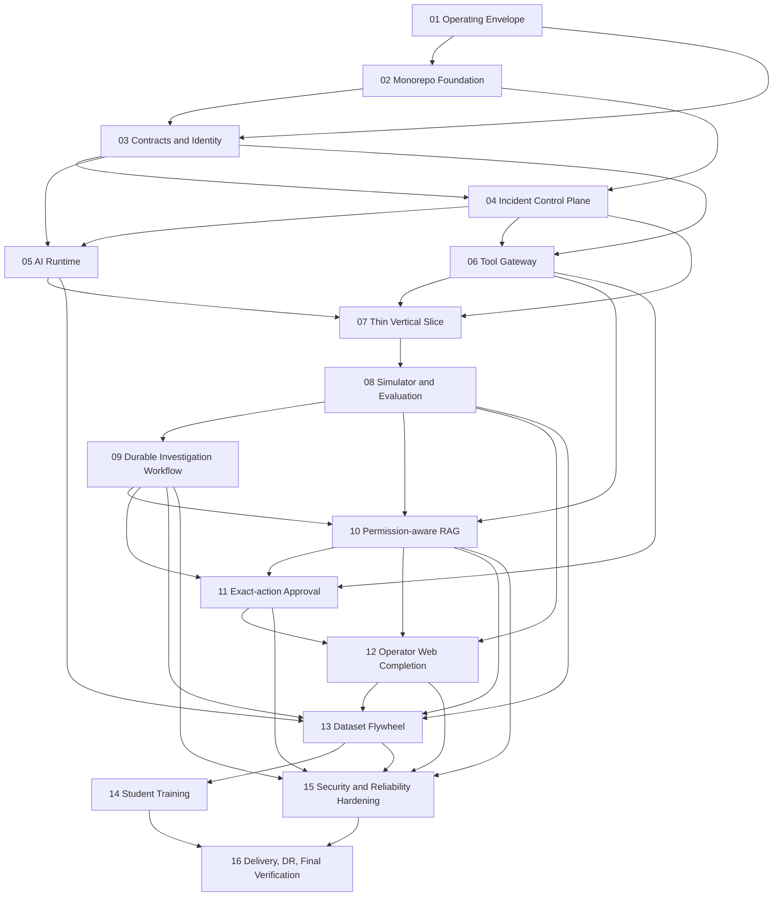

# OpsMind AI Production Platform A-to-Z

## Overview

OpsMind AI began as an almost-empty repository. Phases 1-3 have since created the operating model, polyglot workspace, canonical docs/contracts, and the local trust/data substrate; later-phase product behavior remains gated by this plan rather than inferred from the bootstrap structure.

Accepted scope remains full A-to-Z, but delivery is gate-driven: the approved G0.5 contract now fixes an internal single-organization Singapore deployment target, enterprise OIDC profile, redacted DeepSeek egress policy, Prometheus first connector, S3-compatible evidence boundary, operating envelope, objectives, lifecycle, ownership, and delivery capacity. The next proof is a thin read-only evidence-backed incident investigation, followed by simulator/evaluation, durable workflow, permission-aware knowledge, exact-action approval, dataset/training, and production delivery. Initial runtime shape remains Next.js web, Java 21 Spring modular platform API, Python/FastAPI AI runtime, and isolated Spring Tool Gateway on PostgreSQL plus pgvector; Redis stays optional, and Kafka, Kubernetes, and student serving stay deferred until their graduation gates are met.

## Architecture Decision Summary

| Decision | Locked choice | Why now | Graduation / revisit gate |
|---|---|---|---|
| Control plane | Spring Boot modular monolith | Keeps domain boundaries explicit without premature distributed overhead | Revisit only after measurable scale or team-boundary pressure |
| AI runtime | Separate FastAPI process | Contains provider churn, prompt/schema logic, and evaluation hooks away from control plane | Split further only if RAG or evaluation saturates runtime |
| Tool execution | Separate Spring Tool Gateway | Enforces credential isolation, policy checks, audit, and timeout control | Write-capable tools stay locked until phase 11 exit gate |
| Persistence | PostgreSQL + pgvector | Single source of truth for incidents, audit, authz, RAG metadata, and outbox | Kafka only after outbox/inbox and event volume justify it |
| Durability | Temporal for investigation/HITL/remediation | Durable waits, replay, timers, and exact approval semantics fit the problem directly | Introduce in phase 09 after slice + simulator baseline |
| Contracts | `packages/contracts/{openapi,json-schema,fixtures}` | One generated, versioned source for Java, Python and TypeScript | CI rejects duplicate endpoint/schema ownership elsewhere |
| Evidence artifacts | S3-compatible port owned by incident control plane | Makes evidence bytes, hashes, authorization, retention and restore real before RAG/datasets | Production backend selected at G0.5; local profile remains non-production |
| Delivery order | Thin slice before breadth | Proves the product outcome before expensive hardening and training work | Breadth expands only after slice, simulator, and evaluation gates |

## Phases

| Phase | Name | Status |
|-------|------|--------|
| 1 | [Operating Envelope and Architecture Governance](./phase-01-operating-envelope-and-architecture-governance.md) | Completed |
| 2 | [Monorepo and Developer Platform Foundation](./phase-02-monorepo-and-developer-platform-foundation.md) | In Progress |
| 3 | [Contracts Data Identity and Tenant Foundation](./phase-03-contracts-data-identity-and-tenant-foundation.md) | In Progress |
| 4 | [Incident Control Plane and Audit Ledger](./phase-04-incident-control-plane-and-audit-ledger.md) | In Progress |
| 5 | [DeepSeek AI Runtime and Model Gateway](./phase-05-deepseek-ai-runtime-and-model-gateway.md) | In Progress — static checkpoint PASS; PhaseExitGate BLOCK |
| 6 | [Safe Tool Gateway and Read-only Connectors](./phase-06-safe-tool-gateway-and-read-only-connectors.md) | In progress — checkpoint PASS; PhaseExitGate BLOCK |
| 7 | [Thin Evidence-backed Incident Vertical Slice](./phase-07-thin-evidence-backed-incident-vertical-slice.md) | In progress — deterministic checkpoint PASS; PhaseExitGate BLOCK |
| 8 | [Simulator and Evaluation Baseline](./phase-08-simulator-and-evaluation-baseline.md) | Pending |
| 9 | [Durable Investigation Workflow](./phase-09-durable-investigation-workflow.md) | Pending |
| 10 | [Permission-aware RAG and Knowledge Lifecycle](./phase-10-permission-aware-rag-and-knowledge-lifecycle.md) | Pending |
| 11 | [Exact-action Approval and Reversible Remediation](./phase-11-exact-action-approval-and-reversible-remediation.md) | Pending |
| 12 | [Operator Web Experience Completion](./phase-12-operator-web-experience-completion.md) | Pending |
| 13 | [Dataset Flywheel and Governance](./phase-13-dataset-flywheel-and-governance.md) | Pending |
| 14 | [Student Model Training Shadow and Promotion](./phase-14-student-model-training-shadow-and-promotion.md) | Pending |
| 15 | [Security Reliability and Observability Hardening](./phase-15-security-reliability-and-observability-hardening.md) | Pending |
| 16 | [Delivery Disaster Recovery and Final Verification](./phase-16-delivery-disaster-recovery-and-final-verification.md) | Pending |

Phase 3 remains in progress. A 2026-07-21 local Windows run against
digest-pinned Keycloak 26.7 passes schema-v2, including independent refresh
families for rotation/reuse and revocation controls. The profile/JAR verifier
also passes, but the ignored transcript is marked
`REFERENCE_CONFORMANCE_NOT_PRODUCTION` and records an unborn/dirty worktree.
The configured Linux CI identity job has not run remotely, and no production
IdP decision or broader G2 completion is inferred.

Phase 4 is now in progress at checkpoint 4A: an organization/project-scoped
incident write ledger proving create/read/transition, tenant authorization,
idempotency, concurrency, timeline, database-computed audit chaining, and
outbox atomicity against real PostgreSQL. Evidence-object lifecycle remains
blocked by B-006/B-008/B-012, so neither Phase 4 nor G2 is claimed complete.

Phase 5 is in progress. Its static checkpoint passes; Python reports 149
passed with five PostgreSQL-gated skips, Ruff/mypy are clean, and the full Maven
suite passes. The PhaseExitGate remains blocked by active B-004 (provider
region, terms, retention, and redaction verification) and by absent passing
synthetic smoke with an externally injected rotated staging key. No live
DeepSeek or production egress is claimed.

## Dependencies

No external plan directories were provided as blockers. External runtime dependencies are the identity provider, DeepSeek, PostgreSQL/pgvector, object storage, optional Redis, Temporal, observability backends, and GitHub/VCS integration; each must stay behind adapters until its owning phase lands.

## Dependency Graph

## Invariant Ownership

| Invariant | Primary phases | Enforcement signal |
|---|---|---|
| `INV-01` no unrestricted AI credentials | 06, 11, 15 | Tool Gateway contract suite, credential-scope review, release security audit |
| `INV-02` every RCA claim cites evidence | 04, 07, 08, 10, 12 | RCA schema tests, scenario scoring, UI inspection |
| `INV-03` every write binds to exact approval | 09, 11, 15 | approval digest tests, TOCTOU suite, audit-chain verification |
| `INV-04` tenant boundaries apply everywhere | 03, 06, 10, 12, 15 | authz matrix, RLS negatives, cross-tenant red-team suite |
| `INV-05` model output is untrusted input | 05, 06, 09, 10, 11 | schema validation, malicious argument tests, fail-closed traces |
| `INV-06` retrieved/tool data is evidence, not authority | 06, 07, 09, 10 | prompt-injection suite, tool policy evidence |
| `INV-07` async boundaries are idempotent and recoverable | 03, 04, 09, 11, 16 | outbox/inbox tests, Temporal replay tests, crash/restart drills |
| `INV-08` no secrets or sensitive prompts in repo/default telemetry | 01, 02, 05, 15, 16 | secret scan, log assertions, SBOM/provenance evidence |
| `INV-09` evaluation precedes autonomy/write breadth | 08, 11, 13, 14, 16 | release-gate records, feature flags, benchmark reports |
| `INV-10` heavy local work requires disk preflight | 01, 02, 16 | preflight transcripts, artifact-root config tests, clean-clone audit |

## Milestone Gates

| Gate | Owner phases | Exit condition |
|---|---|---|
| G0 Operating envelope | 01 | Disk preflight, artifact-root policy, ADR baseline, and core docs exist |
| G0.5 Product/production contract | 01 | Deployment archetype, IdP/OIDC profile, DeepSeek egress/data classes, first live connector, evidence store, tenancy/load/SLO/RTO/RPO, retention/residency and owners are approved before Phase 2 |
| G1 Repo bootstrap | 02 | Polyglot workspace, CI skeleton, compose skeleton, and standard commands run without heavy local downloads on `C:` |
| G2 Trust and data base | 03-04 | Real OIDC integration, transaction-local forced RLS, inbox/outbox crash tests, incident state machine, evidence artifact lifecycle and immutable audit are proven |
| G3 Read-only product proof | 05-07 | One evidence-backed flow uses DeepSeek conformance plus at least one live non-production connector with synthetic data; every RCA claim is cited and no write path exists |
| G4 Simulator and evaluation | 08 | Deterministic smoke scenarios, an independently held-out corpus, human baseline protocol and confidence-bearing metrics exist before durable/autonomous breadth |
| G5 Durable and safe actions | 09-11 | Temporal version/replay, exact approval, pre-approval dry-run, target-side CAS, one-effective-write reconciliation and bounded compensation are crash-tested |
| G6 Knowledge, web, data and training evidence | 10-14 | Permission-aware RAG, operator UI, curated datasets and bounded student-training smoke are governed; shadow/canary runs only after its ROI/compute/license entry gate |
| G7 Production readiness | 15-16 | Security, observability, restore drills, delivery pipeline, clean-clone validation, and all DoD evidence are complete |

## Delivery and Staffing Scenarios

These are planning ranges, not commitments. G0.5 must replace them with a staffed work-breakdown estimate including external vendor/legal/procurement lead time and 25-35% contingency.

| Available delivery capacity | Provisional calendar | Practical implication |
|---|---:|---|
| 3-4 core engineers plus fractional security/SRE/product | 10-15 months | Keep one live connector and dry-run-only remediation first; full student shadow/canary likely remains conditional parallel work |
| 6-8 cross-functional contributors | 6-9 months | Recommended minimum for full A-to-Z evidence with Phase 5/6 and Phase 14/15 parallel lanes |
| 9-12 staffed contributors with dedicated QA/security/SRE | 5-8 months | Faster integrations and validation, but shared-contract/review coordination becomes the limiting factor |

Critical path: `G0.5 -> 02 -> 03 -> 04 -> 05/06 -> 07 -> 08 -> 09 -> 10 -> 11 -> 12 -> 13 -> 15 -> 16`. Phase 14 starts after Phase 13 in parallel with Phase 15; bounded training smoke must finish before Phase 16, while shadow/canary/promotion follows its own entry gate.

## Definition-of-Done and Gate Ownership

| ID | Obligation | Owner phase(s) | Required evidence |
|---|---|---|---|
| DoD-01 | Clean clone builds | 02, 16 | clean-room bootstrap transcript, final release audit |
| DoD-02 | Complete local instructions | 01, 02, 16 | `docs/local-development.md`, Windows/Linux validation logs |
| DoD-03 | Docker Compose starts the system | 02, 16 | compose config check, final `up --wait` transcript |
| DoD-04 | Authentication and RBAC work | 03, 16 | authz matrix, invalid/expired token tests |
| DoD-05 | Incident CRUD works | 04, 16 | API integration suite, final browser E2E |
| DoD-06 | DeepSeek integration works with key | 05, 16 | opt-in provider smoke report |
| DoD-07 | Missing key behavior is explicit | 05, 16 | config-startup failure tests |
| DoD-08 | Structured AI output is valid | 05, 08, 16 | schema-validity benchmark |
| DoD-09 | Tool Gateway works | 06, 16 | connector contract and policy suite |
| DoD-10 | Read-only tools are validated and audited | 06, 07, 16 | tool execution audit inspection |
| DoD-11 | Approval workflow works | 09, 11, 16 | expiry/replay/TOCTOU suite |
| DoD-12 | RAG citations and permissions work | 10, 12, 16 | retrieval benchmark, cross-tenant negatives |
| DoD-13 | Ten simulator scenarios work | 08, 16 | scenario rerun report |
| DoD-14 | Dataset generation runs | 13, 16 | dataset artifact, dataset card |
| DoD-15 | Training smoke runs | 14, 16 | bounded smoke run, model card |
| DoD-16 | Evaluation benchmark runs | 08, 13, 16 | versioned benchmark artifacts |
| DoD-17 | Frontend covers the primary workflow | 07, 12, 16 | browser E2E, accessibility report |
| DoD-18 | Unit/integration quality is reasonable | 02-16 | risk-based coverage matrix, mutation/behavior proofs where used |
| DoD-19 | Full incident E2E passes | 07-12, 16 | alert-to-postmortem final run artifact |
| DoD-20 | No secret in repository | 01, 02, 15, 16 | secret scan against history and working tree |
| DoD-21 | No unresolved Critical security issue | 15, 16 | scan triage report, red-team closure |
| DoD-22 | Runtime images run non-root where appropriate | 15, 16 | container runtime inspection |
| DoD-23 | Kubernetes manifests have limits and probes | 16 | manifest validation report |
| DoD-24 | CI pipeline passes | 02, 15, 16 | protected-branch checks, release pipeline report |
| DoD-25 | README contains architecture diagram | 01, 16 | rendered README validation |
| DoD-26 | API documentation exists | 03, 04, 16 | generated OpenAPI and contract tests |
| DoD-27 | Deployment guide exists | 01, 16 | `docs/deployment-guide.md`, staging drill |
| DoD-28 | Security model exists | 01, 15, 16 | `docs/security-model.md`, threat-model link check |
| DoD-29 | Test strategy exists | 01, 16 | `docs/testing-strategy.md`, suite-to-doc audit |
| DoD-30 | Dataset/model card templates exist | 13, 14, 16 | populated template examples |
| DoD-31 | Demo script exists | 16 | timed dry-run walkthrough |
| DoD-32 | Changelog exists | 16 | release-validated `docs/project-changelog.md` |
| DoD-33 | Git history stays small and professional | 01, 02, 16 | commit audit and progress log review |
| DoD-34 | No hidden important TODO | 01, 15, 16 | source/doc scan, known-limitations review |
| DoD-35 | No false completion claim | 16 | requirement-by-requirement final audit |
| ADD-01 | Restore drill with explicit RTO/RPO | 16 | dated restore report under `artifacts/dr/` |
| ADD-02 | Data retention, deletion, residency, privacy decision | 01, 15, 16 | policy ADR, deployment guide, release checklist |
| ADD-03 | Prompt/model rollback and shadow/canary procedure | 14, 15, 16 | rollout playbook and canary evidence |
| ADD-04 | Emergency kill switch for model calls and write-capable tools | 05, 11, 15 | kill-switch test transcript |
| ADD-05 | Approval binds action digest and resource state | 09, 11, 16 | stale-state and TOCTOU tests |
| ADD-06 | Benchmark contamination and leakage controls | 08, 13, 14, 16 | dataset lineage and split-audit report |
| ADD-07 | Cost and storage quotas per tenant | 01, 05, 10, 15, 16 | quota enforcement tests and alert thresholds |
| ADD-08 | Accessibility and operator usability evidence | 07, 12, 16 | WCAG checks, operator walkthrough report |

## Execution Rules

1. Evidence before claims: every phase exits with artifacts under `artifacts/verification/phase-XX/` or a domain-specific sibling such as `artifacts/evaluation/`, `artifacts/security/`, or `artifacts/dr/`.
2. Shared root files are sequential ownership only. `README.md`, `.env.example`, `Makefile`, `scripts/dev/**`, `.github/workflows/**`, `compose.yaml`, `packages/contracts/**`, and `docs/**` can be extended by later phases only after the prior owner phase is complete.
3. `C:` is protected. Heavy caches, Docker layers, datasets, model weights, and benchmark artifacts must default to configurable `D:`-backed roots (`OPS_CACHE_ROOT`, `OPS_ARTIFACT_ROOT`, `OPS_DATA_ROOT`, `OPS_MODEL_ROOT`) unless the operator overrides them safely.
4. No production secrets land in Git, fixtures, screenshots, logs, or benchmark artifacts. Redaction and short-lived credentials are mandatory.
5. Kafka, Kubernetes, dedicated evaluation/RAG services, and student serving are deferred capabilities; no phase may introduce them before their milestone gate says so.
6. Destructive cleanup stays user-approved only. Any automated cleanup created by phase 01 or 02 may detect low disk or stale artifacts, but it must stop short of deletion without explicit operator approval.
7. Java source follows Java package/class naming, Python follows PEP 8, and repository/docs/scripts use descriptive kebab-case; the generic kebab-case preference never overrides a language convention.
8. Student SFT smoke remains in full A-to-Z scope. Full shadow/canary/promotion is a conditional parallel lane and never blocks core security hardening; an evidence-backed `do not promote` is a valid outcome.

## Risk Register

| Risk | Likelihood | Impact | Owning phases | Mitigation |
|---|---|---:|---|---|
| Breadth outruns verified value | High | High | 01-08 | Thin slice first, benchmark second, breadth later |
| Cross-tenant or cross-source data leak | Medium | Critical | 03, 06, 10, 15 | RLS, ACL-before-ranking, negative suites, red-team |
| Prompt injection drives tool misuse | High | Critical | 06, 10, 11, 15 | isolated tool gateway, schema validation, allowlists, approval |
| Temporal or provider complexity stalls delivery | Medium | High | 05, 09 | defer Temporal until slice baseline; keep provider behind adapter |
| Disk exhaustion corrupts local delivery | High | High | 01, 02, 16 | preflight block, artifact roots, explicit storage policy |
| Dataset contamination invalidates student evaluation | Medium | High | 08, 13, 14 | lineage, held-out splits, human review, leakage audits |
| CI/CD and release hardening arrive too late | Medium | High | 02, 15, 16 | minimal CI in phase 02, full hardening in 15, final proof in 16 |

## Red Team Review

Four hostile lenses reviewed the plan: security adversary, failure-mode analyst, assumption destroyer, and scope/complexity critic. Findings were deduplicated to the 15 accepted corrections below; none reverses an explicit user decision.

| ID | Severity | Accepted finding | Plan disposition |
|---|---|---|---|
| RT-01 | Critical | Product/deployment contract is undefined until release | Add blocking G0.5 before Phase 2 and re-estimate afterward |
| RT-02 | Critical | Identity foundation lacks a production OIDC/federation/session contract | Keep the passing local Keycloak reference separate from production IdP/session selection and conformance gates |
| RT-03 | Critical | DeepSeek use precedes enforceable egress/privacy decision and conformance proof | Add tenant/data-class egress policy, DLP and provider-neutral conformance before live incident content |
| RT-04 | High | Tool Gateway language, contracts, migrations, Compose, CI and docs fork across phases | Lock Spring Gateway, one contract tree, per-service migration ownership and canonical root filenames |
| RT-05 | High | Workload identity trusts caller-supplied actor/tenant scope | Platform API issues short-lived delegated capabilities; downstream derives scope only from verified claims |
| RT-06 | Critical | RLS pool context and RAG ACL authority can leak across tenants | Transaction-local forced RLS, separate roles, pool-reuse tests and authorization-before-ranking |
| RT-07 | High | Evidence references have no early durable artifact owner | Phase 4 owns encrypted content-addressed evidence storage and lifecycle |
| RT-08 | High | DB-to-Temporal start, cutover and worker upgrades lack crash/replay protocol | Sole outbox starter, deterministic workflow ID, inbox ordering, build/version routing and golden-history replay |
| RT-09 | High | Provider continuation/stream/tool-loop state is not restart-safe | One bounded exchange per Activity or approved encrypted TTL continuation; streaming/dedupe/budget race tests |
| RT-10 | High | Fixture-only G3 postpones the first real integration fact | Require one live non-production read connector with synthetic data at G3 |
| RT-11 | Critical | Approval/write path is check-then-act and assumes exactly-once external effects | Pre-approval dry-run, bound preview digest, target-side CAS, execution nonce/lease, reconcile ambiguous outcomes and guarded compensation |
| RT-12 | Critical | RAG revoke/delete and dataset/model withdrawal do not invalidate derived copies | Immediate authorization revocation, generation epochs, purge receipts and lineage-triggered snapshot/model quarantine |
| RT-13 | Critical | DR lacks a consistent cut across Temporal/Postgres/artifacts/external effects; ENOSPC untested | Fence admission/writes, capture watermarks, restore disabled, reconcile before resume, inject storage-full failures |
| RT-14 | High | Three/ten deterministic cases cannot substantiate 99%, p95, calibration or human benefit | Separate smoke from release corpus; preregister statistics and collect qualified human baseline/usability evidence |
| RT-15 | High | Estimate is understated and student promotion inflates the production critical path | Use staffed scenario estimate; remove Phase 14 from Phase 15 dependency; make promotion conditional while keeping training smoke mandatory |

Review reports:

- [Security adversary](./reports/from-code-reviewer-to-planner-red-team-security-adversary-plan-review-report.md)
- [Failure modes](./reports/from-code-reviewer-to-planner-red-team-failure-mode-plan-review-report.md)
- [Assumption destroyer](./reports/from-code-reviewer-to-planner-red-team-assumption-destroyer-plan-review-report.md)
- [Scope and complexity](./reports/from-code-reviewer-to-planner-red-team-scope-complexity-plan-review-report.md)
- [Phase 2 adversarial landing audit](./reports/adversarial-review-260720-phase-02.md)
- [Phase 3 trust/data progress](./reports/phase-03-progress-260720.md)

## Validation Log

Validation date: 2026-07-19. Result: **planning structure passes; G0.5 is approved and its strict contract gate passes. Phase 2 is authorized.**

| Check | Result | Evidence / consequence |
|---|---|---|
| CK strict structure | Pass | `ck plan validate .../plan.md --strict`: 16 phases, 0 errors, 0 warnings |
| Phase status at initial plan validation | Pass | Phase 1 had six of six exit criteria complete; phases 2-16 were pending on branch `main` at that historical checkpoint. Current status is tracked in the phase table above. |
| Dependency schema | Pass after correction | Every phase uses `dependencies`; no forward/self edge; P8->P9 and P12->P13 corrected; Phase 14 removed from Phase 15 critical path |
| Requirement traceability | Pass | All 79 `INV/IAM/.../ADD` identifiers from the traceability matrix occur in plan/phase ownership; `AI-03`, `DB-03`, `SIM-02` gaps closed |
| Definition of Done | Pass at plan level | DoD 1-35 each has an owner and authoritative evidence class; no item is marked implemented |
| Internal Markdown links | Pass | All relative links in the plan tree resolve to existing planning/research/report files |
| Canonical topology | Pass after correction | Next.js + Spring platform API + FastAPI AI runtime + Spring Tool Gateway; simulator remains dev/test-only |
| Canonical repository ownership | Pass after correction | `packages/contracts/**`, `compose.yaml`, language-appropriate filenames and sequential shared ownership |
| Red-team correction | Conditional pass | 15 deduplicated findings accepted and mapped to phase tasks/gates; implementation review must verify actual code/evidence later |
| External claims | Conditional | Local Keycloak reference conformance passed; production IdP, provider capabilities/privacy, live connector, and production infrastructure must still be empirically proven in their phases |
| G0.5 strict contract | Pass | Twelve approved decisions; `validate-product-production-contract.ps1` returned `Result=PASS` and exit `0` |
| Local resource safety | Pass for Phase 1 close | Fresh root/capacity preflight passed; every heavy command still requires a fresh check |

Validation decisions:

- Greenfield planned paths are marked as future `CREATE`/`MODIFY`; their current absence is expected, not a validation failure.
- Exact implementation symbols may adjust to conventions created in Phase 2, but a phase may not create a competing runtime, contract root, auth path or migration owner.
- The project owner approved the full G0.5 baseline; Phase 2 may start under the existing safety and verification gates.
- After any G0.5 answer changes topology, identity, egress or delivery scope, rerun strict validation, hostile plan review and dependency/traceability checks.

## Source Reports

- [Brainstorm report](./reports/brainstorm-report.md)
- [Requirements traceability](./research/master-prompt-requirements-traceability.md)
- [Architecture and security research](./research/researcher-01-architecture-security.md)
- [Delivery and evaluation research](./research/researcher-02-delivery-evaluation.md)
- External master prompt input: `C:\Users\Admin\.codex\attachments\c5c12fc9-3ddf-42a4-abaa-79feec71ab9f\pasted-text.txt`

## Unresolved Questions

- No G0.5 product/production question remains unresolved. Production IdP vendor
  conformance, DeepSeek provider terms, measured load/SLO evidence, and restore
  evidence remain phase-owned implementation gates rather than undecided policy.
