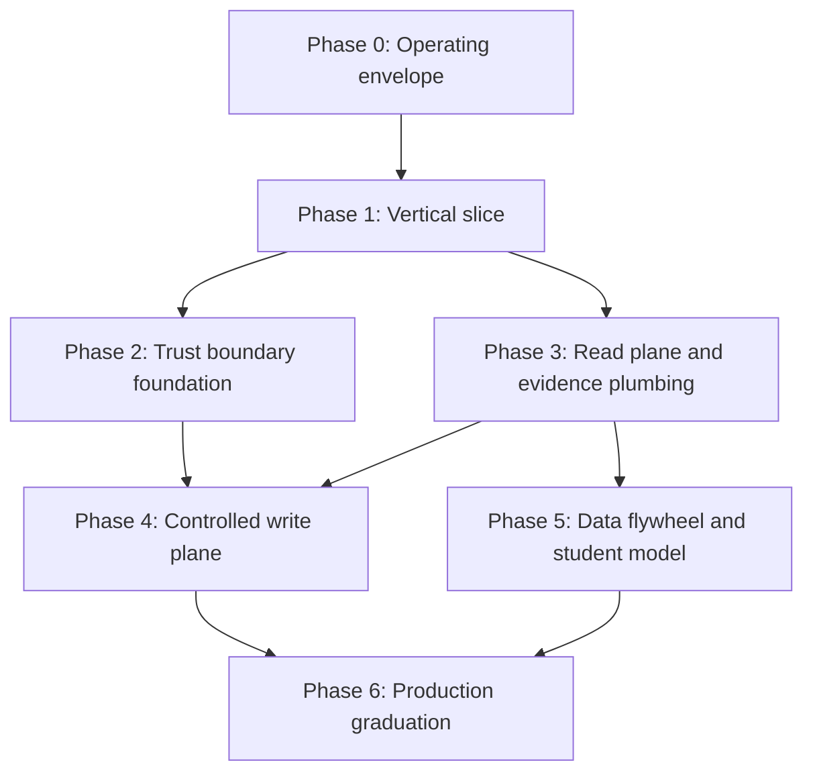

# OpsMind AI Delivery, Quality-Gate, DevSecOps, Observability, Evaluation, and MLOps Roadmap

## Summary

The original 17-phase order is too linear and too late on feedback. For a greenfield OpsMind AI platform, the right move is: build a guarded operating envelope, then a thin vertical slice that proves simulator, evaluation, telemetry, contracts, and a minimal UI before broad feature growth. If you do not have a scoring harness early, you are guessing.

The simulator and evaluation stack should come before autonomy, write actions, and student-model promotion. That is the only way to make quality gates measurable instead of aspirational. Security and threat modeling are not a final phase; they are cross-cutting gates on every surface that can ingest untrusted data or trigger an action.

Production readiness is also a storage and release problem. Given the provided Windows state, C: is already too tight for heavy local work. Treat D: as the working volume, keep C: as OS-only, and block large artifacts, model caches, and Docker layers from landing on C:.

## Evidence Base

| Source | Credibility | Used for |
|---|---|---|
| [GitHub Actions docs](https://docs.github.com/actions) and [deployment environments](https://docs.github.com/actions/deployment/targeting-different-environments/using-environments-for-deployment) | Official, current | CI/CD, environment protection, deployment objects |
| [Kubernetes resource management](https://kubernetes.io/docs/concepts/configuration/manage-resources-containers/), [probes](https://kubernetes.io/docs/tasks/configure-pod-container/configure-liveness-readiness-startup-probes/), [security context](https://kubernetes.io/docs/tasks/configure-pod-container/security-context/), [rolling updates](https://kubernetes.io/docs/concepts/workloads/controllers/deployment/) | Official, current | Graduation gates, runtime safety, rollout behavior |
| [Docker Compose reference](https://docs.docker.com/compose/), [services](https://docs.docker.com/reference/compose-file/services/), [startup order](https://docs.docker.com/compose/how-tos/startup-order/), [deploy resources](https://docs.docker.com/reference/compose-file/deploy/) | Official, current | Local dev topology, healthchecks, resource constraints |
| [OpenTelemetry observability primer](https://opentelemetry.io/docs/concepts/observability-primer/) and [semantic conventions](https://opentelemetry.io/docs/concepts/semantic-conventions/) | Official, current | Traces, metrics, logs, naming discipline |
| [NIST SP 800-34](https://csrc.nist.gov/pubs/sp/800/34/r1/upd1/final), [CISA backup guidance](https://www.cisa.gov/audiences/state-local-tribal-and-territorial-government/secure-us-sltt/back-government-data), [CISA ransomware guide](https://www.cisa.gov/stopransomware/ransomware-guide) | Federal guidance | Backup, contingency, DR, restore testing |
| [Hugging Face dataset cards](https://huggingface.co/docs/hub/datasets-cards), [model cards](https://huggingface.co/docs/hub/model-cards), [evaluation results](https://huggingface.co/docs/hub/eval-results) | Official platform docs | Dataset/model governance, evaluation metadata |
| [MLflow tracing](https://mlflow.org/docs/latest/genai/tracing/), [MLflow LLM evaluation](https://mlflow.org/docs/latest/genai/eval-monitor/), [MLflow tracking](https://mlflow.org/docs/latest/ml/tracking/) | Official platform docs | LLM/agent observability, evaluation, lifecycle tracking |
| [Microsoft Learn Storage Sense](https://learn.microsoft.com/en-us/windows/configuration/storage/storage-sense) | Official platform docs | Windows disk housekeeping and low-space mitigation |

## Recommendation

1. Recommended: outcome-first vertical slice.
2. Acceptable fallback: foundation-first, but only if simulator/evaluation are built in parallel and not postponed.
3. Reject: finish all foundation work, then start simulator/evaluation, then start UI. That sequence delays learning and produces late rework.

### Why the reorder matters

- The simulator/eval harness gives you objective gates early.
- The UI cannot wait until the end. A thin UI must ship with the first slice so humans can inspect evidence, scores, and failures.
- Security hardening must be continuous, not a cleanup sprint.
- Student-model training before benchmark stability is waste.

## Trade-Off Matrix

| Option | Speed to learning | Rework risk | Operational risk | Fit for greenfield OpsMind AI | Rank |
|---|---|---|---|---|---|
| Original 17-phase linear build | Low | Medium early, high late | High, because quality is validated late | Weak | 3 |
| Foundation-first, then features | Medium | Medium | Medium-high, because eval arrives late | Acceptable | 2 |
| Outcome-first vertical slice | High | Medium upfront, lower later | Lower, because quality is measurable early | Best | 1 |

## Reordered Roadmap

### Phase 0: Operating envelope and repo skeleton

| Item | Detail |
|---|---|
| Goal | Establish the rules of the build before feature breadth |
| Deliverables | Repo layout, shared config, local dev scripts, CI skeleton, secret policy, naming conventions, observability schema, disk policy |
| Exit gate | Clean clone boots; lint/typecheck/test skeleton exists; no secrets; C: and D: working rules documented; build artifacts have a home |
| Dependencies | None |
| Effort | 1 to 2 weeks, 1 to 2 engineers |

### Phase 1: Vertical slice

| Item | Detail |
|---|---|
| Goal | Prove one end-to-end incident path with measurable outputs |
| Deliverables | Minimal simulator scenario, incident API, thin UI, evaluation harness, traced request path, schema-validated AI response stub or teacher-backed adapter |
| Exit gate | One scenario runs end-to-end; scores are repeatable; telemetry is visible; human can inspect evidence and result in UI |
| Dependencies | Phase 0 |
| Effort | 2 to 4 weeks, 3 to 5 engineers |

### Phase 2: Trust boundary foundation

| Item | Detail |
|---|---|
| Goal | Lock identity, tenancy, approval, and audit before broader feature work |
| Deliverables | AuthN/AuthZ, RBAC, tenant/project isolation, audit events, idempotency rules, Problem Details error shape, approval framework scaffolding |
| Exit gate | Authorization matrix passes; cross-tenant negative tests pass; audit trail covers sensitive actions; no hidden admin path |
| Dependencies | Phase 1 |
| Effort | 2 to 4 weeks, 3 to 4 engineers |

### Phase 3: Read plane and evidence plumbing

| Item | Detail |
|---|---|
| Goal | Build the read-only tool plane and grounding path |
| Deliverables | Tool Gateway, read-only tools, RAG ingestion, permission filters, citation plumbing, prompt-injection defenses, retrieval evaluation |
| Exit gate | Read-only tools are schema-validated and audited; citations attach to evidence; injection suite and ACL-negative suite pass |
| Dependencies | Phases 1 and 2 |
| Effort | 3 to 5 weeks, 3 to 5 engineers |

### Phase 4: Controlled write plane

| Item | Detail |
|---|---|
| Goal | Add reversible remediation only after approval and rollback exist |
| Deliverables | Approval workflow, reversible actions, dry-run mode, rollback, PR generation, two-person approval for critical actions |
| Exit gate | Approval expiry/replay tests pass; write actions are idempotent or blocked; rollback path is rehearsed |
| Dependencies | Phases 2 and 3 |
| Effort | 2 to 4 weeks, 2 to 4 engineers |

### Phase 5: Data flywheel and student model

| Item | Detail |
|---|---|
| Goal | Create the dataset/evaluation loop before promoting a smaller model |
| Deliverables | Dataset generation, human review workflow, dataset cards, model cards, SFT smoke path, preference data path, benchmark dashboard |
| Exit gate | Dataset governance is enforced; student model only enters shadow or canary after it meets gates; no PII/license leakage in accepted data |
| Dependencies | Phases 1 to 4 |
| Effort | 3 to 6 weeks, 2 to 4 engineers |

### Phase 6: Production graduation

| Item | Detail |
|---|---|
| Goal | Convert the working system into a supportable production platform |
| Deliverables | Dockerfiles, Compose, Helm, Kubernetes manifests, GitHub Actions release flow, observability dashboards, backup/restore drills, DR runbooks, cost controls |
| Exit gate | Staging smoke passes; rollback works; backup restore is tested; SLOs and alerting are live; resource limits and probes exist |
| Dependencies | Phases 0 to 5 |
| Effort | 3 to 5 weeks, 3 to 5 engineers |

## Cross-Cutting Gates

### PR and merge gates

| Gate | Minimum bar |
|---|---|
| Build quality | Format, lint, typecheck, unit tests, contract tests for touched surfaces |
| Security | Secret scan, dependency scan, container scan, SBOM generation |
| Data safety | PII/license/provenance checks on training and retrieval inputs |
| Runtime correctness | Timeout, retry, idempotency, error mapping, audit logging |
| Observability | Trace/metric/log IDs on every request path |

### Release gates

| Gate | Minimum bar |
|---|---|
| Staging smoke | One representative incident flow passes end to end |
| Rollout safety | Canary or staged deploy with environment protection and concurrency control |
| Rollback | Prior artifact or Helm revision can be restored without guesswork |
| DR | Backup restore is rehearsed on a separate target, not just assumed |
| Cost | Token, retrieval, and eval budgets have alert thresholds and kill switches |

### Security gates

| Risk class | Required control |
|---|---|
| Prompt injection | Treat all retrieved and user-supplied text as hostile |
| SSRF / outbound abuse | Allowlist egress, validate URLs |
| IDOR / tenant leak | Enforce resource-level authz in API, tools, and RAG |
| Write abuse | Approvals, digest binding, expiry, optimistic locking |
| Sensitive logging | Redaction at source, no raw secrets or sensitive prompts in logs |

## Test and Evaluation Matrix

### Service and platform tests

| Layer | Tests | Provisional exit criteria | Evidence |
|---|---|---|---|
| API and domain | Unit, repository, controller/service, contract, migration | No failing tests on touched modules; schema and migration checks pass | CI logs, coverage, migration report |
| Auth and tenancy | Role matrix, negative authz, replay, expiry, audit | Zero cross-tenant leaks; denied paths are explicit | Security test report |
| Tool Gateway | Schema, policy, timeout, retry, audit, abuse | Read-only only until approval exists | Tool contract report |
| RAG | Ingestion, dedupe, ACL filter, citation, injection defense | Citations attach to every answer path that claims grounding | Retrieval benchmark |
| Simulator | Scenario reset, determinism, failure injection | At least 10 scenarios before final release | Scenario runbook and rerun logs |
| Infra | Startup, probes, rollout, resource pressure, restore | Rolling update and restore are repeatable | Platform run logs |

### LLM and model evaluation

| Dimension | Provisional metric | Why it matters |
|---|---|---|
| Structured output validity | 99%+ parse success on held-out evals | Bad JSON is operational failure, not a cosmetic issue |
| Citation correctness | High precision on cited evidence, no invented evidence links | RCA credibility depends on traceable claims |
| Tool selection accuracy | Correct read-only tool choice on benchmark scenarios | Wrong tool choice breaks safety and cost |
| Hallucinated root cause rate | Near zero on scenarios with partial evidence | Confidence without evidence is a bug |
| Safety/refusal fidelity | No unsafe write without approval | Prevents silent policy bypass |
| Cost/latency | Measured per request and per scenario | Needed for student-model promotion and budgets |

### Provisional thresholds

These are starting gates, not final policy:

- Structured output parse success: 99%+
- Cross-tenant negative authz: 100%
- Prompt injection suite: 100% of critical cases blocked or neutralized
- Rollback drill: under 15 minutes for the first production tranche
- Backup restore: successful on a separate host or environment every drill cycle
- Student-model promotion: only if it is cheaper/faster and not worse on critical accuracy and safety metrics

## CI/CD, Release, Rollback, and DR

### CI/CD

- Use GitHub Actions with separate PR, main, and release workflows.
- PR workflow: lint, typecheck, unit tests, contract tests, migration validation, secret scan, dependency scan, container scan, SBOM.
- Main workflow: build versioned artifacts, publish reports, and create deployment-ready images.
- Release workflow: tagged release, environment protection, staged deploy, smoke test, then promotion.
- Use GitHub Actions environments so deployments produce explicit deployment objects and can be gated by protection rules.

### Rollback

- Prefer immutable artifact rollback over hotfix guessing.
- For app bugs, roll back the release artifact or Helm revision first.
- For database changes, use forward-fix or reversible migrations only if proven safe; do not rely on untested rollbacks.
- Every release must have a documented last-known-good artifact and a rollback owner.

### Disaster recovery

- Use offline or otherwise separated backups for critical data and configuration.
- Test restore, not just backup creation.
- Define initial RTO/RPO per class of data: incident metadata should recover much faster than training artifacts.
- Run a restore drill before broad beta or production release.
- Keep the DR runbook close to the deployment guide so the team does not treat recovery as a separate universe.

## Disk and Resource Guardrails

The provided environment is already near the edge on C:. That changes the operating policy.

| Rule | Policy |
|---|---|
| C: drive | OS and lightweight tools only; no model caches, Docker layers, large build outputs, or dataset mirrors |
| D: drive | Primary workspace, local caches, build artifacts, eval outputs, and any temporary large files |
| Minimum free space | Keep C: above 10 GB free as an operational floor; if below that, block heavy local work |
| Current state implication | With roughly 5.6 GB free on C:, heavy local build/training work should be deferred or redirected |
| Housekeeping | Use Windows Storage Sense or equivalent cleanup policy for temp files and caches |
| Heavy jobs | No large downloads, Docker image expansion, or local training on this host until storage is rebalanced |

This is an inference from the provided disk state, not an external source claim.

## Student-Model Entry Gate

The student model is not a default optimization. It is a later-stage risk decision.

### Entry conditions

- Teacher model baseline is stable and versioned.
- Dataset and evaluation harness are versioned and reproducible.
- Prompt/response schema is locked for the benchmark set.
- Safety and citation metrics are already measured on the teacher.
- Human review exists for the accepted dataset slices.

### Promotion rule

- Promote the student only if it improves cost or latency materially and does not regress on critical task accuracy, safety, or evidence grounding.
- Use shadow mode first, then a narrow canary, then broader traffic.
- If the student becomes cheaper but less trustworthy on SEV1/SEV2 reasoning, it does not graduate.

### Do not promote if

- Output schema validity drops.
- Unsafe tool call rate rises.
- Hallucinated root-cause rate rises.
- Citation quality drops.
- Confidence calibration is worse than the teacher on hard scenarios.

## Effort Assumptions

### Team shape

- 1 product/technical lead
- 1 platform architect
- 2 backend/platform engineers
- 2 AI/Python engineers
- 1 frontend engineer
- 1 DevOps/SRE engineer
- 1 QA/security shared function

### Calendar estimate

- First useful vertical slice: about 1 to 2 months with a focused team
- Production-grade platform with all graduation gates: about 5 to 7 months for a small cross-functional team
- If the team is smaller than 4 core engineers, cut scope: ship the vertical slice, trust boundary, and read plane first; defer student-model training and broad remediation automation

### Assumptions behind the estimate

- Greenfield repo, but no external dependency dead ends.
- Reuse mature open-source primitives instead of building custom infra.
- No large local training workload on the workstation; heavy compute runs elsewhere.
- One main production environment and one staging environment before multi-region or multi-cloud.

## Explicit Deferrals

These are intentionally deferred, not forgotten:

- Multi-region active-active
- Kafka unless event volume or coupling proves it is required
- Full-scale student-model training before benchmark stability
- Advanced autonomous write remediation before approval and rollback are proven
- Excessive frontend polish before the first vertical slice works
- Multi-cloud portability before single-cloud production readiness
- Custom schedulers or bespoke infra unless the stack proves a real need

## What This Report Does Not Cover

- Final service decomposition and domain model boundaries
- Exact database schema
- Exact prompt templates
- The architecture deep dive for each service
- Final vendor choice for hosting, logging, and model serving

Those belong to the other researcher or to the architecture phase after the delivery sequence is agreed.

## Source URLs

- https://docs.github.com/actions
- https://docs.github.com/actions/deployment/targeting-different-environments/using-environments-for-deployment
- https://kubernetes.io/docs/concepts/configuration/manage-resources-containers/
- https://kubernetes.io/docs/tasks/configure-pod-container/configure-liveness-readiness-startup-probes/
- https://kubernetes.io/docs/tasks/configure-pod-container/security-context/
- https://kubernetes.io/docs/concepts/workloads/controllers/deployment/
- https://docs.docker.com/compose/
- https://docs.docker.com/reference/compose-file/services/
- https://docs.docker.com/compose/how-tos/startup-order/
- https://docs.docker.com/reference/compose-file/deploy/
- https://opentelemetry.io/docs/concepts/observability-primer/
- https://opentelemetry.io/docs/concepts/semantic-conventions/
- https://csrc.nist.gov/pubs/sp/800/34/r1/upd1/final
- https://www.cisa.gov/audiences/state-local-tribal-and-territorial-government/secure-us-sltt/back-government-data
- https://www.cisa.gov/stopransomware/ransomware-guide
- https://huggingface.co/docs/hub/datasets-cards
- https://huggingface.co/docs/hub/model-cards
- https://huggingface.co/docs/hub/eval-results
- https://mlflow.org/docs/latest/genai/tracing/
- https://mlflow.org/docs/latest/genai/eval-monitor/
- https://mlflow.org/docs/latest/ml/tracking/
- https://learn.microsoft.com/en-us/windows/configuration/storage/storage-sense

## Unresolved Questions

- Which cloud and region strategy is assumed for production?
- Is the first production release expected to include any write-capable remediation, or should it stay read-only?
- What is the target business SLA for incident analysis turnaround, and what RTO/RPO should the platform commit to?
- Will the student model ever be allowed to act autonomously, or only as a cheaper suggestion engine under teacher fallback?
