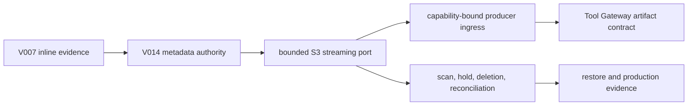

# Durable Evidence Artifact Control Plane

## Purpose

Deliver the missing durable artifact plane behind the approved S3-compatible
boundary without treating object URLs, an object-store bucket, or a test
filesystem as authorization. This is Phase 4C under the active A-to-Z plan;
it advances the implementation evidence for B-006/B-008/B-012 but does not
close those program blockers until a supported backend, KMS, scanning,
retention/deletion, restore, and reconciliation evidence exist.

## Scope Challenge

- Existing code: V007 already gives immutable, tenant-scoped, redacted inline
  evidence records with SHA-256 verification and a 64 KiB cap. ADR-0003
  already fixes metadata authority, lifecycle, and the S3-compatible boundary.
- Minimum change: add a separate V014 metadata control plane and port. Do not
  widen V007, place network I/O inside its transaction, or make large bodies
  visible to the current AI prompt path.
- Complexity: this crosses migration, authorization, lifecycle, streaming I/O,
  Tool Gateway contracts, and operational reconciliation. The plan therefore
  executes sequentially with explicit interface boundaries rather than trying
  to merge all concerns into one class or migration.
- Selected scope: HOLD. The approved lifecycle is preserved; provider-specific
  production decisions remain explicit external gates.

## Locked Design Constraints

1. PostgreSQL is authoritative for tenant/project/incident scope, lifecycle,
   digest, byte count, authorization epoch, retention, storage reference, and
   audit relation. Storage object location is never authorization.
2. V007 remains an inline-only immutable record. V014 is additive; no applied
   migration is edited and no artifact bytes enter `evidence_records`,
   investigation events, audit JSON, operator projections, prompts, logs, or
   error bodies.
3. Object I/O occurs outside the metadata transaction. The service records a
   durable `PENDING_UPLOAD` intent, streams with a bounded length/digest,
   then finalizes a fenced state transition in a second transaction.
4. All artifact reads re-authorize current tenant/project/incident access and
   verify lifecycle, authorization epoch, storage generation, and expected
   digest before a stream is opened. A streaming reader re-hashes the complete
   body; downstream processing must treat bytes as untrusted and cannot cite,
   persist a derived result, or expose a verdict until the final digest check
   succeeds. The first slice has no public artifact download.
5. Any unavailable storage, metadata, scan decision, authorization drift,
   digest mismatch, or unknown state fails closed. No fallback filesystem or
   public signed URL is production behavior.
6. The existing Tool Gateway and AI Runtime continue rejecting artifact
   references until Phase 03 supplies an explicit, capability-bound transport
   contract and a separate cross-service review.

## Delivery Phases

| Phase | Status | Objective | Depends on |
|---|---|---|---|
| [01 Metadata and lifecycle authority](./phase-01-metadata-and-lifecycle-authority.md) | In progress | Add V014 artifact metadata, deterministic lifecycle policy, scoped repository, and authorization/read guards. | V007 / Phase 4B |
| [02 Bounded S3-compatible streaming port](./phase-02-bounded-s3-streaming-port.md) | Pending | Add default-off storage configuration, durable upload claim/attempt protocol, real bounded streaming adapter, and fenced finalization. | Phase 01; backend/KMS configuration decision |
| [03 Controlled ingress and lifecycle operations](./phase-03-controlled-ingress-and-lifecycle-operations.md) | Pending | Add capability-bound producer integration, scan/hold/delete/reconcile operations, and release-grade conformance evidence. | Phase 02; supported backend and operational owners |

## Dependency and Ownership Map

| Area | Sole phase owner | Shared-boundary rule |
|---|---|---|
| `services/platform-api/.../evidence/artifact/**`, V014 and artifact tests | 01 then 02/03 sequentially | No phase edits V007 semantics or existing inline classes except a deliberate, reviewed authorization extraction. |
| `services/platform-api/.../incident/**` authorization seam | 01 | Preserve established non-enumerating authorization and transaction-local tenant binding. |
| `services/platform-api/.../investigation/integration/**`, `services/tool-gateway/**`, contracts | 03 | Untouched before Phase 03; current artifact-reference rejection remains a security control. |
| CI/validation/docs/runbooks | Owning phase only, sequentially | Existing Phase 4B validator stays historical; a new Phase 4C validator owns new files. |

## Acceptance Boundaries

Phase 01 proves metadata/lifecycle authority, tenant isolation, idempotency,
authorization-epoch/lifecycle denial, digest/length validation, and no raw
artifact leakage. It does **not** prove that a real object was stored.

Phase 02 proves a concrete, bounded S3-compatible adapter against an approved
test environment and KMS configuration contract. It remains default-off and
does not close the supported-backend, production KMS, scan, retention,
residency, or restore gates by source inspection alone.

Phase 03 proves that a workload/capability-authenticated producer can use the
artifact service without receiving arbitrary bucket access, and that scanning,
hold/deletion, purge receipt, orphan reconciliation, and restore boundaries
are operationally testable. Production promotion additionally needs the
external evidence listed in `docs/blockers.md`.

## Verification Strategy

| Risk | Required proof |
|---|---|
| Scope bypass or enumeration | Current membership/incident authorization before metadata lookup; foreign tenant/project/incident/run tests return the existing safe not-found contract. |
| Mutation/replay | Additive V014 SQL constraints, forced RLS, least-privilege grants, exact idempotency keys, lifecycle version fence, fresh and upgrade PostgreSQL tests. |
| Corrupt/partial bytes | Streaming digest and exact length tests; finalization rejects mismatches; adapter error leaves retryable metadata and never marks an artifact available. |
| Information leak | Event/audit/projection/log tests prove raw content, object URLs, credentials, KMS material, and signed URLs never appear. |
| Cross-system consistency | Durable claim/attempt tests cover before-write, after-write/before-finalize, timeout-after-Put, lease takeover, repeated finalization, immutable-object collision, and orphan classification. |
| Regression | Existing Phase 4B static/migration gate and focused Platform tests remain green; heavy PostgreSQL/Docker suites run only in remote CI while D: remains below its safety threshold. |

## Explicitly Deferred

- Selecting or operating a production storage vendor, account topology,
  replication, object lock, malware scanner, or KMS key topology.
- Relaxing Tool Gateway’s oversized-result rejection or Platform’s
  `artifact_reference` rejection.
- Sending artifact bodies to AI Runtime, browser clients, RAG, datasets, or
  public upload/download endpoints.
- Claiming B-006, B-008, B-011, or B-012 is resolved without a supported
  backend decision and independently retained operational evidence.

## Rollback

All migrations are forward-only. If Phase 01 or 02 fails, keep artifact
features disabled, preserve authoritative metadata/audit rows for
investigation, and stop new artifact ingress. Never delete objects or rewrite
metadata as automatic rollback.
